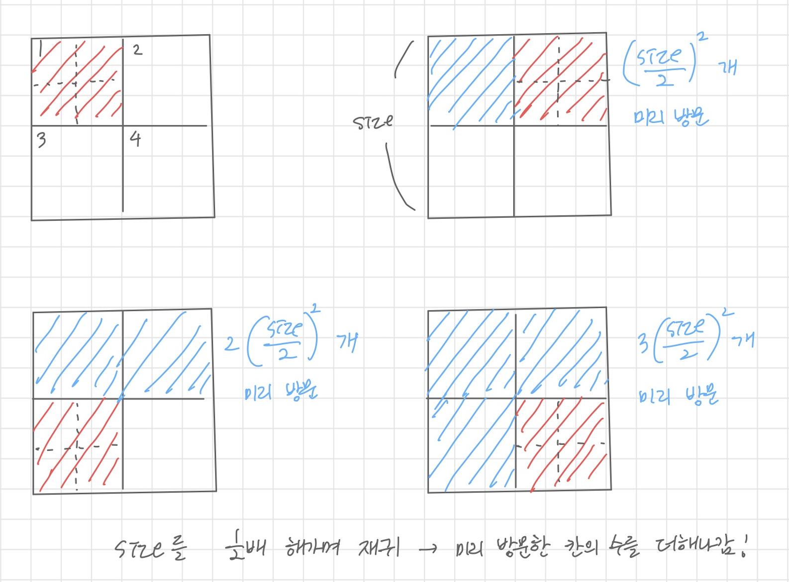

# ch7(devide and conquer) - 백준 문제 풀이

by | 혜민  
pub date | 2021.01.01.Fri


## [1780 - 종이의 개수](../hyemin/7_DevideAndConquer/bj/1780.cpp)

### 문제

N×N크기의 행렬로 표현되는 종이가 있다. 종이의 각 칸에는 -1, 0, 1의 세 값 중 하나가 저장되어 있다. 우리는 이 행렬을 적절한 크기로 자르려고 하는데, 이때 다음의 규칙에 따라 자르려고 한다.

1. 만약 종이가 모두 같은 수로 되어 있다면 이 종이를 그대로 사용한다.
2. (1)이 아닌 경우에는 종이를 같은 크기의 9개의 종이로 자르고, 각각의 잘린 종이에 대해서 (1)의 과정을 반복한다.

이와 같이 종이를 잘랐을 때, -1로만 채워진 종이의 개수, 0으로만 채워진 종이의 개수, 1로만 채워진 종이의 개수를 구해내는 프로그램을 작성하시오.

### 입력

첫째 줄에 N(1≤N≤3^7, N은 3^k 꼴)이 주어진다. 다음 N개의 줄에는 N개의 정수로 행렬이 주어진다.

### 출력

첫째 줄에 -1로만 채워진 종이의 개수를, 둘째 줄에 0으로만 채워진 종이의 개수를, 셋째 줄에 1로만 채워진 종이의 개수를 출력한다.

### 풀이

```cpp
// 종이의 숫자를 저장하는 배열
int paper[2187][2187];
// 각 숫자가 채워진 종이의 개수를 저장하는 배열
int countPaper[3] = {0, 0, 0};

// 모두 같은 수로 채워져 있는지 확인
bool isUniform(int row, int col, int size) {
    for(int i = row; i < row + size; i++) {
        for(int j = col; j < col + size; j++) {
            // 왼쪽 위의 점과 현재 점이 다르면
            if (paper[row][col] != paper[i][j]) {
                return false;
            }
        }
    }
    return true;
}

void devideAndConquer(int row, int col, int size) {
    // 숫자가 같으면 해당 수의 종이 개수 증가
    if (isUniform(row, col, size)) {
        countPaper[paper[row][col]]++;
    }
    // 9개의 구역으로 나누어 재귀 호출
    else {
        int newSize = size / 3;
        for(int i = 0; i < 3; i++) {
            for (int j = 0; j < 3; j++) {
                devideAndConquer(row + i * newSize, col + j * newSize, newSize);
            }
        }

    }
}

int main() {
    int n;
    cin >> n;

    for(int i = 0; i < n; i ++) {
        for (int j = 0; j < n; j++) {
            int input;
            cin >> input;
            // 0, 1, 2로 저장해서 count하기 편하게
            paper[i][j] = input + 1;
        }
    }
    
    devideAndConquer(0, 0, n);

    for (int i = 0; i < 3; i++) {
        cout << countPaper[i] << endl;
    }
}
```


## [1074 - Z](../hyemin/7_DevideAndConquer/bj/1074.cpp)

### 문제

한수는 크기가 2N × 2N인 2차원 배열을 Z모양으로 탐색하려고 한다. 예를 들어, 2×2배열을 왼쪽 위칸, 오른쪽 위칸, 왼쪽 아래칸, 오른쪽 아래칸 순서대로 방문하면 Z모양이다.

만약, N > 1이 라서 왼쪽 위에 있는 칸이 하나가 아니라면, 배열을 크기가 2N-1 × 2N-1로 4등분 한 후에 재귀적으로 순서대로 방문한다.

N이 주어졌을 때, r행 c열을 몇 번째로 방문하는지 출력하는 프로그램을 작성하시오.

### 입력

첫째 줄에 정수 N, r, c가 주어진다.

### 출력

r행 c열을 몇 번째로 방문했는지 출력한다.

### 풀이




```cpp
// 순서 저장
int order = 0;

// 위치에 따라 각개격파
void countOrder (int row, int col, int size) {
    int nextSize = size / 2;
    // 기저 사례 
    if ( size == 1 ) {
        return;
    }
    // 1사분면에 위치할 경우
    else if ( nextSize > row && nextSize > col ) {
        countOrder(row, col, nextSize);
    }
    // 2사분면에 위치할 경우
    else if ( nextSize > row && nextSize <= col ) {
        order += (int) pow(1.0 * nextSize, 2.0);
        countOrder(row, col - nextSize, nextSize);
    }
    // 3사분면에 위치할 경우
    else if ( nextSize <= row && nextSize > col ) {
        order += (int) 2 * pow(1.0 * nextSize, 2.0);
        countOrder(row - nextSize, col, nextSize);
    } 
    // 4사분면에 위치할 경우
    else {
        order += (int) 3 * pow(1.0 * nextSize, 2.0);
        countOrder(row - nextSize, col - nextSize, nextSize);
    }
}

int main() {
    int N, r, c;
    cin >> N >> r >> c;

    countOrder(r, c, pow(2.0, 1.0 * N));

    cout << order << endl;
}
```


## [6549 - 히스토그램에서 가장 큰 직사각형](../hyemin/7_DevideAndConquer/bj/6549.cpp)

### 문제

히스토그램은 직사각형 여러 개가 아래쪽으로 정렬되어 있는 도형이다. 각 직사각형은 같은 너비를 가지고 있지만, 높이는 서로 다를 수도 있다.

히스토그램에서 가장 넓이가 큰 직사각형을 구하는 프로그램을 작성하시오.

### 입력

입력은 테스트 케이스 여러 개로 이루어져 있다. 각 테스트 케이스는 한 줄로 이루어져 있고, 직사각형의 수 n이 가장 처음으로 주어진다. (1 ≤ n ≤ 100,000) 그 다음 n개의 정수 h1, ..., hn (0 ≤ hi ≤ 1,000,000,000)가 주어진다. 이 숫자들은 히스토그램에 있는 직사각형의 높이이며, 왼쪽부터 오른쪽까지 순서대로 주어진다. 모든 직사각형의 너비는 1이고, 입력의 마지막 줄에는 0이 하나 주어진다.

### 출력

각 테스트 케이스에 대해서, 히스토그램에서 가장 넓이가 큰 직사각형의 넓이를 출력한다.

### 풀이

```cpp
// 히스토그램의 높이 저장
vector<long long> histogram(0,0);

long long measureArea(long start, long end) {
    // 기저 사례
    if (start == end) {
        return histogram[start];
    }
    long mid = (start + end) / 2;
    // 반으로 나눠서 각개격파
    long long area = max(measureArea(start, mid), measureArea(mid + 1, end));
    // 가운데에 걸친 경우
    long left = mid;
    long right = mid + 1;
    long long currentHeight = min(histogram[left], histogram[right]);
    // 확장 전 가운데 걸린 두 칸짜리 사각형을 후보에!
    area = max(area, currentHeight * 2);
    while(start < left || right < end) {
        // 오른쪽으로 확장하는 경우 : 왼쪽 끝까지 이미 확장했거나 오른쪽이 왼쪽보다 클 때
        if(right < end && (start == left || histogram[left-1] < histogram[right+1])) {
            ++right;
            currentHeight = min(currentHeight, histogram[right]);
        }
        // 왼쪽으로 확장하는 경우 : 오른쪽 끝까지 이미 확장했거나 왼쪽이 오른쪽보다 클 때 
        else {
            --left;
            currentHeight = min(currentHeight, histogram[left]);
        }
        // 양쪽에서 구한 넓이, 확장되면서 변하는 넓이들 중에서 가장 큰 값으로 업데이트
        area = max(area, currentHeight * (right - left + 1));
    }

    return area;
}

int main() {
    long n;
    do {
    cin >> n;
    for (long i = 0; i < n; i++) {
        long long input;
        cin >> input;
        histogram.push_back(input);
    }
    cout << endl;    
    cout << measureArea(0, n - 1);
    histogram.clear();
    }
    while (n != 0);
}
```

위와 같이 풀 경우, 오버플로로 메모리 초과가 발생해 `main()`함수를 다시 아래와 같이 수정해 주었다

```cpp
int main() {
    long n;
    while (1) {
    cin >> n;
    if (n == 0) break;
    for (long i = 0; i < n; i++) {
        long long input;
        cin >> input;
        histogram.push_back(input);
    }
    cout << endl;    
    cout << measureArea(0, n - 1);
    histogram.clear();
    }
```


## [12846 - 무서운 아르바이트](../hyemin/7_DevideAndConquer/bj/12846.cpp)

### 문제

성화는 악독하기로 유명한 편의점 사장이다. 그의 편의점에는 특이한 임금 체계를 가지고 있다.

- 각 날마다 일의 차이때문에 일마다 급여가 정해져 있다.
- 돈은 당일에 주지 않고 퇴직을 할 때 한번에 준다.
- 성화는 욕심쟁이라서 해당 일을 한 동안 중 가장 일급이 작을 때를 기준으로 급여를 지급한다.
- 일급이 다른 것을 들키지 않기 위하여 한번이라도 퇴직한 자를 다시 취직 시키지 않는다. (만약 취직을 한다면, 일을 시작 한 날부터 끝날 때까지 하루도 빠지면 안 된다.)

준수는 n+1일 후에 001에 월세를 내야 해서 성화가 사장으로 있는 편의점에 취직하려 한다. 다행히 주변 퇴직자들의 얘기로 급여에 관련해 파악했다. 또한 퇴직자들의 급여 통계를 통해 당장 n일 후까지 일급 정보를 알아냈다. 최대로 많이 일했을 때가 최대 이익이 아닐 수 있다.

어제까지 과제를 제출하고 지금도 001에서 자고 있는 준수를 위해 코딩 잘하는 여러분이 일을 해서 벌 수 있는 최대 이익을 준수에게 알려주도록 하자.

### 입력

일을 할 수 있는 날의 수 (0 < n ≤ 100000) 가 주어진다.

그 다음 줄에는 1일부터 n일 까지 일급 Ti 가 순서대로 주어진다. (0 < Ti ≤ 1,000,000)

### 출력

준수가 일을 해서 벌 수 있는 최대 이익을 출력한다.

### 풀이

```cpp
vector<long> dailyProfit(0,0);

long maximumProfit(long start, long end) {
    // 기저 사례
    if (start == end) {
        return dailyProfit[start];
    }
    long mid = (start + end) / 2;
    // 반으로 나눠서 각개격파
    long area = max(maximumProfit(start, mid), maximumProfit(mid + 1, end));
    // 가운데에 걸친 경우
    long left = mid;
    long right = mid + 1;
    // 히스토그램의 높이에 해당하는 임금!
    long currentProfitHeight = min(dailyProfit[left], dailyProfit[right]);
    // 확장 전 가운데 위치 날짜의 임금들을 후보에
    area = max(area, currentProfitHeight * 2);
    while(start < left || right < end) {
        // 오른쪽으로 확장하는 경우 : 왼쪽 끝까지 이미 확장했거나 오른쪽이 왼쪽보다 클 때
        if(right < end && (start == left || dailyProfit[left-1] < dailyProfit[right+1])) {
            ++right;
            currentProfitHeight = min(currentProfitHeight, dailyProfit[right]);
        }
        // 왼쪽으로 확장하는 경우 : 오른쪽 끝까지 이미 확장했거나 왼쪽이 오른쪽보다 클 때 
        else {
            --left;
            currentProfitHeight = min(currentProfitHeight, dailyProfit[left]);
        }
        // 각개격파로 구한 임금, 확장되면서 변하는 임금의 합 중에서 가장 큰 값으로 업데이트
        area = max(area, currentProfitHeight * (right - left + 1));
    }
    return area;
}

int main() {
    long n;
    cin >> n;
    for (long i = 0; i < n; i++) {
        long input;
        cin >> input;
        dailyProfit.push_back(input);
    }
    cout << maximumProfit(0, n - 1) << endl;    
}
```


