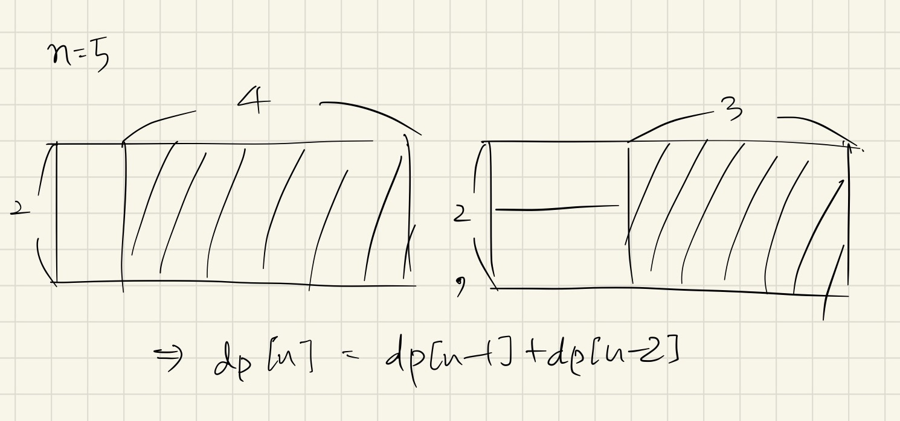
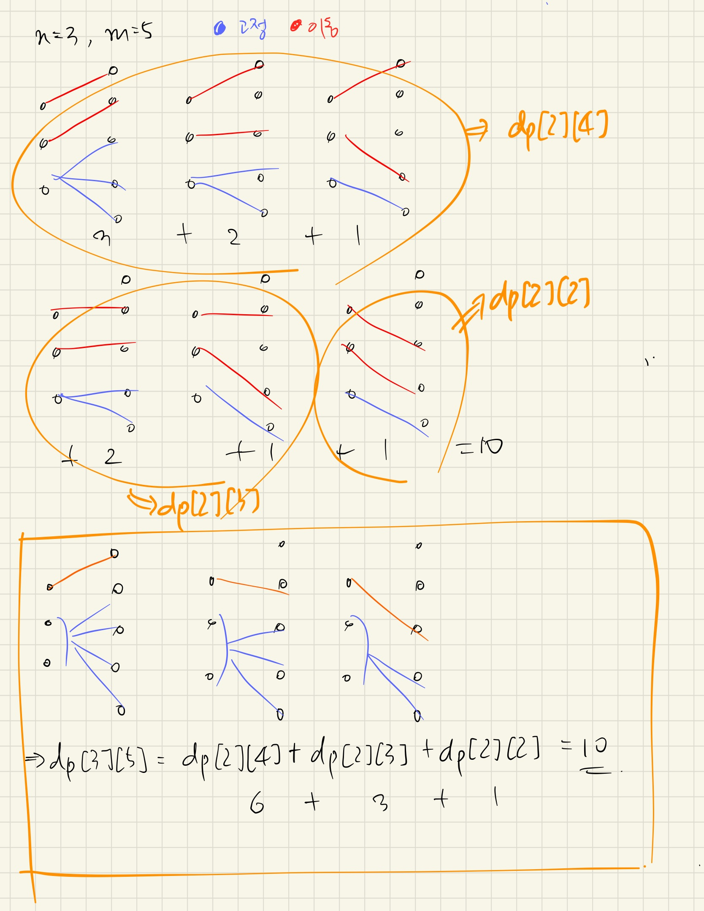

# ch8(dynamic programming) - 백준 문제 풀이

by | 지은   
pub date | 2021.01.09.Sat

## 동적 계획법
- 중복되는 문제 → 캐시에 저장
- 대표 문제: 이항 계수 - n개의 서로 다른 원소 중 r개의 원소를 순서없이 골라내는 방법의 수  
- 함수의 중복 호출을 줄이자!  
👩‍🏫 메모이제이션(memoization): 반복 계산되는 부분 문제들의 답을 미리 저장  

**메모이제이션**
1. 기저 사례를 먼저 처리
2. cache 초기화
3. ret는 cache에 대한 참조형으로 사용 (값을 저장할 때 유용)
- Tip! `memset()`을 이용하여 `cache[]` 초기화하기  

**최적화 문제 동적 계획법 레시피**  
1. 모든 답을 만들어 보고 그중 최적해의 점수를 반환하는 완전 탐색 알고리즘을 설계
2. 전체 답의 점수를 반환하는 것이 아니라, 앞으로 남은 선택들에 해당하는 점수만을 반환하도록 부분 문제 정의를 바꿈
3. 재귀 호출의 입력에 이전의 선택에 관련된 정보가 있다면 꼭 필요한 것만 남기고 줄이기
4. 입력이 배열이거나 문자열인 경우 가능하다면 적절한 변환을 통해 메모이제이션
5. 메모이제이션 적용 

**경우의 수와 확률**
1. 모든 답을 직접 만들어서 세어보는 완전 탐색 알고리즘 설계
2. 최적화 문제를 해결할 때처럼 이전 조각에서 결정한 요소들에 대한 입력을 없애거나 변형해서 줄이기
3. 메모이제이션 적용

예제: 타일링 방법의 수 세기 (boj 11726)

## 11726 - 2*n 타일링
### 문제
2×n 크기의 직사각형을 1×2, 2×1 타일로 채우는 방법의 수를 구하는 프로그램을 작성하시오.
아래 그림은 2×5 크기의 직사각형을 채운 한 가지 방법의 예이다. (그림 생략)  

### 입력
첫째 줄에 n이 주어진다. (1 ≤ n ≤ 1,000)

### 출력
첫째 줄에 2×n 크기의 직사각형을 채우는 방법의 수를 10,007로 나눈 나머지를 출력한다.



[교재 풀이]
```c++
const int MOD = 10007;
int cache[1001];

int tiling(int n) {
    if (n <= 1) return 1;
    int& ret = cache[n];
    if (ret != -1) return ret;
    return ret = (tiling(n-2) + tiling(n-1)) % MOD;
}

int main() {
    int n;
    cin >> n;
    memset(cache, -1, sizeof(cache));
    cout << tiling(n);
}
```

[일반적인 풀이]
```c++
int main() {
    int n;
    int dp[1000];
    cin >> n;
    dp[1] = 1;
    dp[2] = 2;
    for (int i=3; i<=n; i++) {
        dp[i] = (dp[i-1] + dp[i-2]) % 10007;
    }
    cout << dp[n] % 10007;
}
```

## 1932 - 정수 삼각형
### 문제
```
        7
      3   8
    8   1   0
  2   7   4   4
4   5   2   6   5
```
위 그림은 크기가 5인 정수 삼각형의 한 모습이다.  
맨 위층 7부터 시작해서 아래에 있는 수 중 하나를 선택하여 아래층으로 내려올 때, 이제까지 선택된 수의 합이 최대가 되는 경로를 구하는 프로그램을 작성하라. 아래층에 있는 수는 현재 층에서 선택된 수의 대각선 왼쪽 또는 대각선 오른쪽에 있는 것 중에서만 선택할 수 있다.  
삼각형의 크기는 1 이상 500 이하이다. 삼각형을 이루고 있는 각 수는 모두 정수이며, 범위는 0 이상 9999 이하이다.

### 입력
첫째 줄에 삼각형의 크기 n(1 ≤ n ≤ 500)이 주어지고, 둘째 줄부터 n+1번째 줄까지 정수 삼각형이 주어진다.

### 출력
첫째 줄에 합이 최대가 되는 경로에 있는 수의 합을 출력한다.
  

```c++
int main() {
    int n;
    cin >> n;
    int dp[MAX][MAX];
    for (int i=0; i<n; i++) {
        for (int j=0; j<=i; j++) {
            cin >> dp[i][j];
        }
    }

    for (int i=1; i<n; i++) {
        for (int j=0; j<=i; j++) {
            if (j == 0) { // 좌측 끝
                dp[i][j] += dp[i-1][j];
            } else if (j == i) { // 우측 끝
                dp[i][j] += dp[i-1][j-1];
            } else { // 중간
                dp[i][j] += max(dp[i-1][j-1], dp[i-1][j]);
            }
        }
    }

    int max = 0;
    int* lastRow = dp[n-1];
    for (int i=0; i<n; i++) {
        if (lastRow[i] > max) max = lastRow[i];
    }
    cout << max;
}
```

## 11053 - 가장 긴 증가하는 부분 수열
### 문제
수열 A가 주어졌을 때, 가장 긴 증가하는 부분 수열을 구하는 프로그램을 작성하시오.  
예를 들어, 수열 A = {10, 20, 10, 30, 20, 50} 인 경우에 가장 긴 증가하는 부분 수열은 A = {10, 20, 10, 30, 20, 50} 이고, 길이는 4이다.

### 입력
첫째 줄에 수열 A의 크기 N (1 ≤ N ≤ 1,000)이 주어진다.  
둘째 줄에는 수열 A를 이루고 있는 Ai가 주어진다. (1 ≤ Ai ≤ 1,000)

### 출력
첫째 줄에 수열 A의 가장 긴 증가하는 부분 수열의 길이를 출력한다.

```c++
int main() {
    int n;
    int arr[1001];
    int dp[1001];
    cin >> n;
    for (int i=0; i<n; i++) {
        cin >> arr[i];
    }
    // 길이는 최소 1
    int cnt = 1;
    for (int i=0; i<n; i++) {
        // 모든 index에 대해서 자기 자신 하나는 포함하므로 1로 초기화
        dp[i] = 1;
        for (int j=0; j<i; j++) {
            // 현재 arr[i] 왼쪽에 있는 숫자(arr[j])가 자기 자신(arr[i])보다 작다면 dp를 갱신
            if (arr[i] > arr[j]) {
                dp[i] = max(dp[i], dp[j]+1);
            }
        }
        cnt = max(cnt, dp[i]);
    }
    cout << cnt;
}
```

## 14501 - 퇴사
### 문제
상담원으로 일하고 있는 백준이는 퇴사를 하려고 한다.  
오늘부터 N+1일째 되는 날 퇴사를 하기 위해서, 남은 N일 동안 최대한 많은 상담을 하려고 한다.  
백준이는 비서에게 최대한 많은 상담을 잡으라고 부탁을 했고, 비서는 하루에 하나씩 서로 다른 사람의 상담을 잡아놓았다.  
각각의 상담은 상담을 완료하는데 걸리는 기간 Ti와 상담을 했을 때 받을 수 있는 금액 Pi로 이루어져 있다.  
N = 7인 경우에 다음과 같은 상담 일정표를 보자.  

| |1일|2일|3일|4일|5일|6일|7일|
|---|---|---|---|---|---|---|---|
|Ti|3|5|1|1|2|4|2|
|Pi|10|20|10|20|15|40|200|

1일에 잡혀있는 상담은 총 3일이 걸리며, 상담했을 때 받을 수 있는 금액은 10이다. 5일에 잡혀있는 상담은 총 2일이 걸리며, 받을 수 있는 금액은 15이다.  
상담을 하는데 필요한 기간은 1일보다 클 수 있기 때문에, 모든 상담을 할 수는 없다. 예를 들어서 1일에 상담을 하게 되면, 2일, 3일에 있는 상담은 할 수 없게 된다. 2일에 있는 상담을 하게 되면, 3, 4, 5, 6일에 잡혀있는 상담은 할 수 없다.  
또한, N+1일째에는 회사에 없기 때문에, 6, 7일에 있는 상담을 할 수 없다.  
퇴사 전에 할 수 있는 상담의 최대 이익은 1일, 4일, 5일에 있는 상담을 하는 것이며, 이때의 이익은 10+20+15=45이다.  
상담을 적절히 했을 때, 백준이가 얻을 수 있는 최대 수익을 구하는 프로그램을 작성하시오.  

### 입력
첫째 줄에 N (1 ≤ N ≤ 15)이 주어진다.  
둘째 줄부터 N개의 줄에 Ti와 Pi가 공백으로 구분되어서 주어지며, 1일부터 N일까지 순서대로 주어진다. (1 ≤ Ti ≤ 5, 1 ≤ Pi ≤ 1,000)  

### 출력
첫째 줄에 백준이가 얻을 수 있는 최대 이익을 출력한다.


```c++
int main() {
    int n;
    // T[i] = 각 상담의 소요 기간, P[i] = 각 상담의 페이, dp[i] = i일까지 얻을 수 있는 페이
    int T[16], P[16], dp[16];
    cin >> n;
    for (int i=1; i<=n; i++) {
        cin >> T[i] >> P[i];
        // 초기화: dp[i] = i일에 일한 페이
        dp[i] = P[i];
    }

    int result = 0;
    // 1일은 안 세도 됨
    // 일단 퇴사 날짜와 상관 없이 카운트
    for (int i=2; i<=n; i++) {
        for (int j=1; j<i; j++) {
            // 기준일부터 수행 기간을 더한 값이 현재 날짜를 넘어가지 않는다면
            if (i-j >= T[j]) {
                dp[i] = max(dp[i], P[i]+dp[j]);
            }
        }
    }
    // i일에 시작한 일을 퇴사 전(<=n+1)까지 끝낼 수 있는 경우들에 대해서만 result를 갱신
    for (int i=1; i<=n; i++) {
        if (i+T[i] <= n+1) {
            result = max(result, dp[i]);
        }
    }

    cout << result;
}
```

## 1010 - 다리 놓기 (조합 문제)
### 문제
재원이는 한 도시의 시장이 되었다. 이 도시에는 도시를 동쪽과 서쪽으로 나누는 큰 일직선 모양의 강이 흐르고 있다. 하지만 재원이는 다리가 없어서 시민들이 강을 건너는데 큰 불편을 겪고 있음을 알고 다리를 짓기로 결심하였다. 강 주변에서 다리를 짓기에 적합한 곳을 사이트라고 한다. 재원이는 강 주변을 면밀히 조사해 본 결과 강의 서쪽에는 N개의 사이트가 있고 동쪽에는 M개의 사이트가 있다는 것을 알았다. (N ≤ M)   
재원이는 서쪽의 사이트와 동쪽의 사이트를 다리로 연결하려고 한다. (이때 한 사이트에는 최대 한 개의 다리만 연결될 수 있다.) 재원이는 다리를 최대한 많이 지으려고 하기 때문에 서쪽의 사이트 개수만큼 (N개) 다리를 지으려고 한다. 다리끼리는 서로 겹쳐질 수 없다고 할 때 다리를 지을 수 있는 경우의 수를 구하는 프로그램을 작성하라.

### 입력
입력의 첫 줄에는 테스트 케이스의 개수 T가 주어진다. 
그 다음 줄부터 각각의 테스트케이스에 대해 강의 서쪽과 동쪽에 있는 사이트의 개수 정수 N, M (0 < N ≤ M < 30)이 주어진다.  

### 출력
각 테스트 케이스에 대해 주어진 조건하에 다리를 지을 수 있는 경우의 수를 출력한다.



```c++
int main() {
    int t;
    int dp[31][31] = {0, };

    for (int i=1; i<31; i++) {
        // 서쪽 다리 1개라면 다리는 동쪽 사이트 수만큼 존재 
        dp[1][i] = i;
    }

    // 문제 조건에서 N<=M이므로 (i=N, j=M이라고 가정) 
    for (int i=2; i<31; i++) {
        for (int j=i; j<31; j++) {
            for (int k=j-1; k>=i-1; k--) {
                // k가 i-1보다 작아지는 것 방지 (겹쳐짐 문제)
                dp[i][j] += dp[i-1][k];
            }
        }
    }

    cin >> t;
    for (int i=0; i<t; i++) {
        int n, m;
        cin >> n >> m;
        cout << dp[n][m] << "\n";
    }
}
```  
