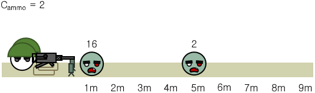
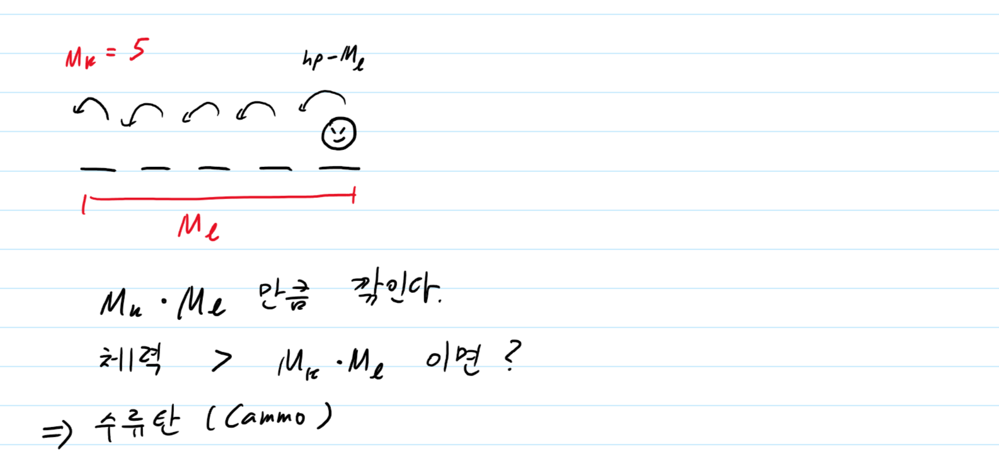

# Ch18 선형 자료 구조, Ch19 큐와 스택, 데크

by | 상원

pub date | 2021.01.16.Sat

# 에디터

## 문제

커서는 문장의 맨 앞(첫 번째 문자의 왼쪽), 문장의 맨 뒤(마지막 문자의 오른쪽), 또는 문장 중간 임의의 곳(모든 연속된 두 문자 사이)에 위치할 수 있다. 즉 길이가 L인 문자열이 현재 편집기에 입력되어 있으면, 커서가 위치할 수 있는 곳은 L+1가지 경우가 있다.

| L    | 커서를 왼쪽으로 한 칸 옮김 (커서가 문장의 맨 앞이면 무시됨)  |
| :--- | ------------------------------------------------------------ |
| D    | 커서를 오른쪽으로 한 칸 옮김 (커서가 문장의 맨 뒤이면 무시됨) |
| B    | 커서 왼쪽에 있는 문자를 삭제함 (커서가 문장의 맨 앞이면 무시됨) 삭제로 인해 커서는 한 칸 왼쪽으로 이동한 것처럼 나타나지만, 실제로 커서의 오른쪽에 있던 문자는 그대로임 |
| P $  | $라는 문자를 커서 왼쪽에 추가함                              |

초기에 편집기에 입력되어 있는 문자열이 주어지고, 그 이후 입력한 명령어가 차례로 주어졌을 때, 모든 명령어를 수행하고 난 후 편집기에 입력되어 있는 문자열을 구하는 프로그램을 작성하시오. 단, 명령어가 수행되기 전에 커서는 문장의 맨 뒤에 위치하고 있다고 한다.

## 입력

첫째 줄에는 초기에 편집기에 입력되어 있는 문자열이 주어진다. 이 문자열은 길이가 N이고, 영어 소문자로만 이루어져 있으며, 길이는 100,000을 넘지 않는다. 둘째 줄에는 입력할 명령어의 개수를 나타내는 정수 M(1 ≤ M ≤ 500,000)이 주어진다. 셋째 줄부터 M개의 줄에 걸쳐 입력할 명령어가 순서대로 주어진다. 명령어는 위의 네 가지 중 하나의 형태로만 주어진다.

## 출력

첫째 줄에 모든 명령어를 수행하고 난 후 편집기에 입력되어 있는 문자열을 출력한다.


## 풀이

- 현재 가리키고 있는 문자(now)의 바로 오른쪽을 커서라고 가정했다

```python
# 1406 
import sys

# 양방향 연결 리스트의 구현
class ListNode:
    def __init__(self, element):
        self.element = element
        self.prev = None
        self.next = None
        
class LinkedList:
    def __init__(self):
        # head 에 0 을 element로 가지는 head 를 추가한다. 요소가 하나일 때 삭제를 구현하기 위함
        head = ListNode(0)
        self.head = head
        self.now = head
        
    def append(self, node):
        # now 와 next 사이에 node를 끼워 넣는다
        now = self.now
        next = self.now.next
        # node 의 prev 와 next 를 지정해준다
        node.next = next
        node.prev = now
        # now.next 와 next.prev를 node 로 설정한다. next=None인 경우에는 아무것도 하지 않는다.
        now.next = node
        if next != None:
            next.prev = node
        self.now = self.now.next
    
    def leftMove(self):
        if self.now.prev != None:
            self.now = self.now.prev
            
    def rightMove(self):
        if self.now.next != None:
            self.now = self.now.next
       
    def delete(self):
        if self.now.prev != None:
            prev = self.now.prev
            next = self.now.next
            prev.next = next
            if next != None:
                next.prev = prev
            # 위에서 언급한 것처럼 head 에 빈 요소를 넣지 않으면 
            # 모든 요소가 삭제된 후 now 가 머물 곳이 없다.
            self.now = prev
    
    def print(self):
        # head 이후부터 출력한다.
        cur = self.head.next
        while cur.next != None:
            print(cur.element, end="")
            cur = cur.next
        print(cur.element)
            
        
string = sys.stdin.readline().strip()

linked = LinkedList()
for char in string:
    linked.append(ListNode(char))
    
M = int(sys.stdin.readline())
for i in range(M):
    action = sys.stdin.readline().strip()
    if action[0] == "L":
        linked.leftMove()
    elif action[0] == "D":
        linked.rightMove()
    elif action[0] == "B":
        linked.delete()
    elif action[0] == "P":
        linked.append(ListNode(action[-1]))

linked.print()
```


# 좀비 떼가 기관총 진지에도 오다니

## 문제

기관총 진지 앞쪽 길의 거리는 *L* m이며, 진지로부터 *i* m 떨어진 곳에 있는 좀비의 체력은 *Zi*이다. 체력이 0 이하가 된 좀비는 영구적으로 죽는다.

기관총 진지에서 킬로와 헥토는 좀비가 1 m 이동할 때 기관총 또는 수평 세열 지향성 지뢰를 한 번 사용할 수 있다. 수평 세열 지향성 지뢰를 격발하는 경우 후폭풍을 피하기 위해 킬로와 헥토는 기관총 진지 밑으로 숨어야 한다. 즉, 수평 세열 지향성 지뢰 격발과 기관총 사격을 **동시**에 할 수는 없다.

- 기관총




유효 사거리는 진지 앞으로부터 *ML* m이다. 유효 사거리 내의 각 1 m 마다 좀비의 체력을 *MK*만큼 낮춘다. 

기관총 탄약은 엄청나게 많이 있으므로 신경쓰지 않아도 된다. 총열 교체나 장전, 총기 이상 등을 고려할 필요 없이 계속 사격할 수 있다고 가정한다.

- 수평 세열 지향성 지뢰


유효 사거리는 진지 앞으로부터 1 m이다. 하지만 진지 바로 앞 1 m의 좀비는 체력과 상관없이 제압할 수 있다.

수평 세열 지향성 지뢰는 *Cammo*개 있다. 

기관총 진지라곤 하나 콘크리트로 지어진 토치카가 아니라 사대로 구축한 임시 진지이기 때문에 1 m 떨어진 길 위의 좀비를 제압하지 못한다면 사망한다. 

## 입력

첫 번째 줄에는 기관총 진지 앞쪽 길의 거리를 나타내는 정수 *L* (1 ≤ *L* ≤ 3 × 106)이 주어진다. 

두 번째 줄에는 기관총의 유효 사거리를 나타내는 정수 *ML* (1 ≤ *ML* ≤ 3 × 106)과 각 1 m 당 살상력을 나타내는 정수 *MK* (1 ≤ *MK* ≤ 100)가 빈칸을 사이에 두고 주어진다.

세 번째 줄에는 수평 세열 지향성 지뢰의 개수 *Cammo* (0 ≤ *Cammo* ≤ 3 × 106)가 주어진다.

네 번째 줄부터 *L*개의 줄에 걸쳐서 정수가 하나씩 주어진다. 이 때 *i* (1 ≤ *i* ≤ *L*)번째 정수는 기관총 진지에서 *i* m 떨어진 곳의 좀비의 체력 *Zi* (0 ≤ *Zi* ≤ 3 × 108)이다. *Zi*가 0인 경우 *i* m 떨어진 곳에 좀비가 없다는 뜻이다.

## 출력

킬로와 헥토가 살아남을 수 있다면 `YES`, 살아남을 수 없다면 `NO`를 출력한다.


## 풀이 - 왜 안되지😂 -> 쓰다가 깨달음



```python
import sys

def solve(L, Cammo):
    for i in range(L):
        hp = int(sys.stdin.readline())
        if hp > Mk*min([Ml, L]):
            if Cammo <= 0:
                return False
            Cammo -= 1
    return True

L = int(sys.stdin.readline())
Ml, Mk = map(int, sys.stdin.readline().split())
Cammo = int(sys.stdin.readline())

if solve(L, Cammo):
    print("YES")
else:
    print("NO")
```


# 외계인의 기타 연주

## 문제

기타는 1번 줄부터 6번 줄까지 총 6개의 줄

예를 들어, 3번 줄의 5번 프렛을 이미 누르고 있다고 하자. 이때, 7번 프렛을 누른 음을 연주하려면, 5번 프렛을 누르는 손을 떼지 않고 다른 손가락으로 7번 프렛을 누르고 줄을 튕기면 된다. 여기서 2번 프렛의 음을 연주하려고 한다면, 5번과 7번을 누르던 손가락을 뗀 다음에 2번 프렛을 누르고 연주해야 한다.

이렇게 손가락으로 프렛을 한 번 누르거나 떼는 것을 손가락을 한 번 움직였다고 한다. 어떤 멜로디가 주어졌을 때, 손가락의 가장 적게 움직이는 회수를 구하는 프로그램을 작성하시오.

## 입력

첫째 줄에 멜로디에 포함되어 있는 음의 수 N과 한 줄에 있는 프렛의 수 P가 주어진다. (N ≤ 500,000, 2 ≤ P ≤ 300,000)

다음 N개 줄에는 멜로디의 한 음을 나타내는 두 정수가 주어진다. 첫 번째 정수는 줄의 번호이고 두 번째 정수는 그 줄에서 눌러야 하는 프렛의 번호이다. 입력으로 주어진 음의 순서대로 기타를 연주해야 한다.

## 출력

첫째 줄에 멜로디를 연주하는데 필요한 최소 손가락 움직임을 출력한다.

## 풀이

```python
import sys

# 단방향 연결 리스트를 이용한 스택의 구현 (파이썬은 스택 자료형을 따로 제공하지 않는다. )
# 그러나 리스트로 구현하는 게 더 간단(리스트는 동적 배열 기반, 맨 뒤에 원소 추가 삭제는 O(1) 안에 끝남)

class Stack:
    class Node:
        def __init__(self, element):
            self.element = element
            self.prev = None
            
    def __init__(self):
        self.tail = None
        
    def push(self, element):
        node = self.Node(element)
        node.prev = self.tail
        self.tail = node
        
    def pop(self):
        tail = self.tail
        self.tail = self.tail.prev
        return tail.element
    
    def lastnum(self):
        if self.tail == None:
            return None
        return self.tail.element

N, P = map(int, sys.stdin.readline().split())

stacks = [None for i in range(6)]
# 각 줄마다 스택 생성
for i in range(6):
    stacks[i] = Stack()
    
count = 0
for i in range(N):
    string, fret = map(int, sys.stdin.readline().split())
    stack = stacks[string-1]
    
    # 스택이 비어있거나, 마지막 요소보다 크면 스택에 추가하고, count+1
    if stack.lastnum() == None or stack.lastnum() < fret:
        count += 1
        stack.push(fret)

    # 스택의 마지막 요소보다 프렛이 작으면 스택에서 뺀다(마지막 요소가 더 작아질 때까지), count+1
    if stack.lastnum() > fret:
        while stack.lastnum() != None and stack.lastnum() > fret:
            stack.pop()
            count += 1
        if stack.lastnum() == None or stack.lastnum() < fret:
            stack.push(fret)
            count += 1

print(count)
```


# 연세워터파크 

- 덱을 이용하면 O(n) 내에 풀 수 있다?
- 해설을 찾아봐도 이해가 안된다...

## 문제

정수 Ki (-109 ≤ Ki ≤ 109)가 쓰여진 징검다리 N개

- 각 사람은 시작점으로 쓸 징검다리 하나를 아무 것이나 하나 고른다.
- 시작점에서 출발한 뒤 계속 점프하여 징검다리를 몇 개든 마음대로 밟은 뒤, 나오고 싶을 때 나온다. 시작점에서 바로 나오는 것도 가능하다.
- 시작점을 포함해, 밟은 모든 징검다리에 쓰여진 정수의 합이 가장 큰 사람이 이긴다.

- N개의 모든 징검다리에 순서대로 1 ~ N의 번호를 붙인다. U번 징검다리에서 V번 징검다리로 점프하기 위해서는, U와 V의 차이가 미리 정해진 값 D 이하여야 한다.
- 어떤 징검다리도 두 번 이상(한 번을 넘게) 밟을 수는 없다.

## 입력

첫 줄에 징검다리의 수 N과 문제에서 설명한 D가 주어진다. (2 ≤ N ≤ 105, 1 ≤ D ≤ N-1)

이어 N개의 정수로, 각 징검다리에 쓰인 수 Ki가 1번 징검다리부터 N번 징검다리까지 순서대로 주어진다. (-109 ≤ Ki ≤ 109)

## 출력

가능한 최대 점수를 출력한다.

```python

```

[참고 사이트](https://blog.naver.com/kks227/221386454504)