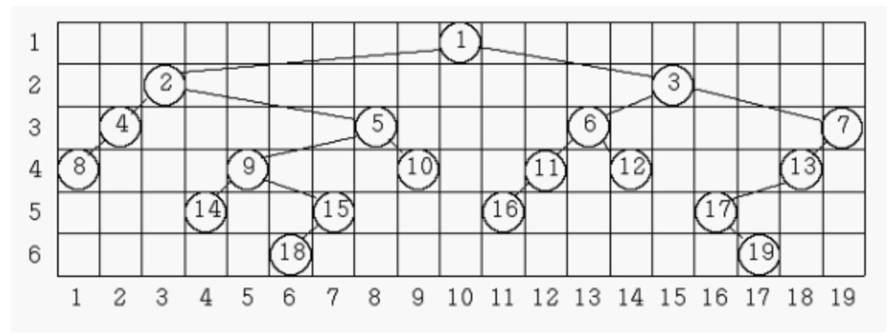
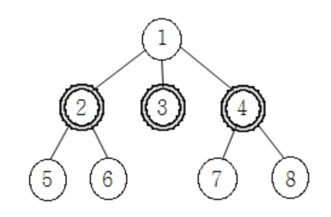
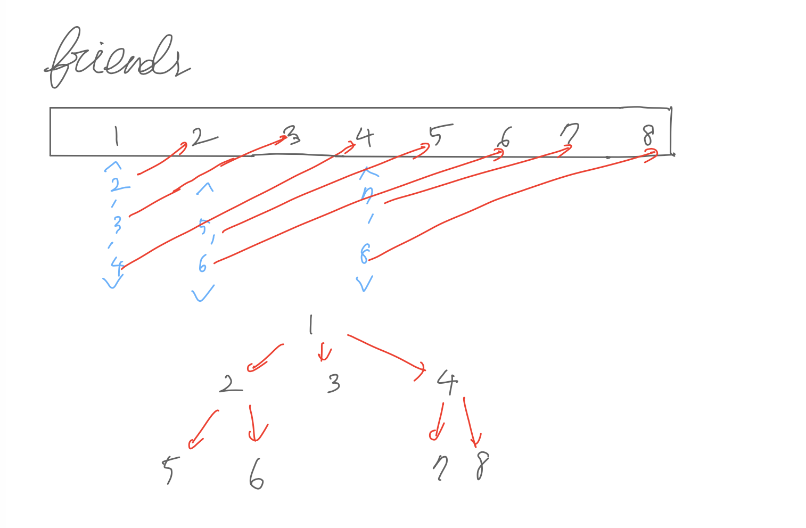

# Ch21 트리, Ch21 이진 검색 트리

by | 혜민

pub date | 2021.01.23.Sat

# 트리의 순회

## 문제

n개의 정점을 갖는 이진 트리의 정점에 1부터 n까지의 번호가 중복 없이 매겨져 있다. 이와 같은 이진 트리의 인오더와 포스트오더가 주어졌을 때, 프리오더를 구하는 프로그램을 작성하시오.

## 입력

첫째 줄에 n(1≤n≤100,000)이 주어진다. 다음 줄에는 인오더를 나타내는 n개의 자연수가 주어지고, 그 다음 줄에는 같은 식으로 포스트오더가 주어진다.

## 출력

첫째 줄에 프리오더를 출력한다.

## 풀이

```c++
// 2263

vector<int> subVector(vector<int> sourceVector, int start, int end) {
    vector<int> sub;
    sub.clear();
    if (start <= end) {
        sub = vector<int>(sourceVector.begin() + start, sourceVector.begin() + end + 1);
    }
    return sub;
}

void preOrder(vector<int> inOrder, vector<int> postOrder) {
    int nodes = inOrder.size();
    // 기저 사례
    if (nodes == 0) return;
    if (nodes == 1) {
        cout << inOrder[0] << " ";
        return;
    }

    int root = postOrder[nodes - 1];
    int rootIndex = find(inOrder.begin(), inOrder.end(), root) - inOrder.begin();
    int maxLeftIndex = rootIndex - 1;
    cout << root << " ";
    // 왼쪽 순회
    preOrder(subVector(inOrder, 0, maxLeftIndex), subVector(postOrder, 0, maxLeftIndex));
    // 오른쪽 순회
    preOrder(subVector(inOrder, rootIndex + 1, nodes - 1), subVector(postOrder, rootIndex, nodes - 2));
}

int main() {
    int nodes;
    cin >> nodes;
    vector<int> inOrder;
    vector<int> postOrder;

    for (int i = 0; i < nodes; i++) {
        int input;
        cin >> input;
        inOrder.push_back(input);
    }
    for (int j = 0; j < nodes; j++) {
        int input;
        cin >> input;
        postOrder.push_back(input);
    }
    preOrder(inOrder, postOrder);
    cout << endl;
}
```

재귀 호출하며 벡터를 자를 때마다, `subVector()`에서 새로 벡터를 만들고 복사하고 있어서 메모리 초과 발생!
벡터를 따로 복사하지 않고, 인덱스만 넘겨주며 root를 찾아 출력하도록 변경

```cpp

vector<int> inOrder;
vector<int> postOrder;

void preOrder(int inOrderStart, int inOrderEnd, int postOrderStart, int postOrderEnd) {
    int nodeSize = inOrderEnd - inOrderStart + 1;
    // 기저 사례
    if (inOrderStart > inOrderEnd || postOrderStart > postOrderEnd) return;

    int root = postOrder[postOrderEnd];
    int rootIndex = find(inOrder.begin(), inOrder.end(), root) - inOrder.begin();

    cout << root << " ";

    if (nodeSize > 1) {
    preOrder(inOrderStart, rootIndex-1, postOrderStart, postOrderStart + (rootIndex - inOrderStart - 1));
    preOrder(rootIndex+1, inOrderEnd, postOrderStart + rootIndex - inOrderStart, postOrderEnd - 1);
    }
}

int main() {
    int nodes;
    cin >> nodes;
    for (int i = 0; i < nodes; i++) {
        int input;
        cin >> input;
        inOrder.push_back(input);
    }
    for (int j = 0; j < nodes; j++) {
        int input;
        cin >> input;
        postOrder.push_back(input);
    }
    preOrder(0, inOrder.size()-1, 0, postOrder.size()-1);
    cout << endl;
}

```

- 헷갈렸던 부분! inOrder와 postOrder의 위치가 완전히 같지 않다는 점! 개수는 같으나 위치가 다르다

```cpp
    // 지금은 인덱스 같아보이지만 애초에 다른 위치의 조각에서 길이만 같이 떼어난 거라 같아 보임 이렇게 짜면 안 됨
    // 왼쪽 순회
    preOrder(inOrderStart, rootIndex-1, postOrderStart, rootIndex - 1);
    // 오른쪽 순회
    preOrder(rootIndex+1, inOrderEnd, rootIndex, postOrderEnd - 1);
```


# 트리의 높이와 너비

## 문제

이진트리를 다음의 규칙에 따라 행과 열에 번호가 붙어있는 격자 모양의 틀 속에 그리려고 한다. 이때 다음의 규칙에 따라 그리려고 한다.

이진트리에서 같은 레벨(level)에 있는 노드는 같은 행에 위치한다.
한 열에는 한 노드만 존재한다.
임의의 노드의 왼쪽 부트리(left subtree)에 있는 노드들은 해당 노드보다 왼쪽의 열에 위치하고, 오른쪽 부트리(right subtree)에 있는 노드들은 해당 노드보다 오른쪽의 열에 위치한다.
노드가 배치된 가장 왼쪽 열과 오른쪽 열 사이엔 아무 노드도 없이 비어있는 열은 없다.
이와 같은 규칙에 따라 이진트리를 그릴 때 각 레벨의 너비는 그 레벨에 할당된 노드 중 가장 오른쪽에 위치한 노드의 열 번호에서 가장 왼쪽에 위치한 노드의 열 번호를 뺀 값 더하기 1로 정의한다. 트리의 레벨은 가장 위쪽에 있는 루트 노드가 1이고 아래로 1씩 증가한다.

아래 그림은 어떤 이진트리를 위의 규칙에 따라 그려 본 것이다. 첫 번째 레벨의 너비는 1, 두 번째 레벨의 너비는 13, 3번째, 4번째 레벨의 너비는 각각 18이고, 5번째 레벨의 너비는 13이며, 그리고 6번째 레벨의 너비는 12이다.



우리는 주어진 이진트리를 위의 규칙에 따라 그릴 때에 너비가 가장 넓은 레벨과 그 레벨의 너비를 계산하려고 한다. 위의 그림의 예에서 너비가 가장 넓은 레벨은 3번째와 4번째로 그 너비는 18이다. 너비가 가장 넓은 레벨이 두 개 이상 있을 때는 번호가 작은 레벨을 답으로 한다. 그러므로 이 예에 대한 답은 레벨은 3이고, 너비는 18이다.

임의의 이진트리가 입력으로 주어질 때 너비가 가장 넓은 레벨과 그 레벨의 너비를 출력하는 프로그램을 작성하시오

## 입력

줄에 노드의 개수를 나타내는 정수 N(1 ≤ N ≤ 10,000)이 주어진다. 다음 N개의 줄에는 각 줄마다 노드 번호와 해당 노드의 왼쪽 자식 노드와 오른쪽 자식 노드의 번호가 순서대로 주어진다. 노드들의 번호는 1부터 N까지이며, 자식이 없는 경우에는 자식 노드의 번호에 -1이 주어진다.

## 출력

첫째 줄에 너비가 가장 넓은 레벨과 그 레벨의 너비를 순서대로 출력한다. 너비가 가장 넓은 레벨이 두 개 이상 있을 때에는 번호가 작은 레벨을 출력한다.

## 풀이

- `width`는 왼쪽 서브트리 -> 루트 -> 오른쪽 서브트리 순으로 증가하므로 중위 순회! 즉 중위순회 한 순서를 인덱스로 저장
- `height`는 순회 depth이므로 너비 우선 탐색을 통해 탐색해 내려가는 단계를 높이로 저장

```cpp
const int MAX = 10000 + 1;
const int INF = 987654321;

int nodeIndex; // 현재 순회한 노드의 순서 (가로 방향 인덱스)
int leftIndex[MAX]; // 현 높이에서 가장 왼쪽에 있는 노드의 인덱스
int rightIndex[MAX]; // 현 높이에서 가장 오른쪽에 있는 노드의 인덱스

pair<int, int> tree[MAX]; // 트리 구조 구현하는 array

// 중위 순회
void inOrderTraversal(int nodeNum, int height) {
    // 왼쪽 서브트리 방문
    if (tree[nodeNum].first > 0)
        inOrderTraversal(tree[nodeNum].first, height + 1);

    // 현재 높이에서 가장 좌측, 우측 노드 업데이트
    // 중위 순회하므로 현재 높이에서 가장 왼쪽 인덱스로 내가 후보가 될 수 있음!
    leftIndex[height] = min(leftIndex[height], nodeIndex);
    // 중위 순회하므로 현재 높이에서 가장 오른쪽 인덱스로 나+1이 후보가 될 수 있음!
    rightIndex[height] = max(rightIndex[height], nodeIndex++);

    // 오른쪽 서브트리 방문
    if (tree[nodeNum].second > 0)
        inOrderTraversal(tree[nodeNum].second, height + 1);
}

int main() {
    int n;
    int checked[MAX]; // 체크한 횟수 저장. 루트이면 체크한 횟수 1번 뿐이므로 루트를 찾는 데에 이용
    cin >> n;
    // left를 크게 초기화해서 나중에 right-left의 최대 길이에서 작은 값이 무시될 수 있도록
    for (int i = 0; i < MAX; i++) {
        leftIndex[i] = INF;
    }
    // 자식 추가
    for (int i = 0; i < n; i++) {
        int current, leftChild, rightChild;
        cin >> current >> leftChild >> rightChild;
        // 현재 노드 체크
        checked[current]++;
        if (leftChild != -1) {
            checked[leftChild]++;
        }
        tree[current].first = leftChild;
        if (rightChild != -1) {
            checked[rightChild]++;
        }
        tree[current].second = rightChild;
    }
    // 루트 찾기
    int root;
    for (int i = 1; i <= n; i++) {
        if (checked[i] == 1) {
            root = i;
        }
    }

    // 중위 순회
    nodeIndex = 1;
    inOrderTraversal(root, 1);

    //최대 길이를 구한다
    int result = rightIndex[1] - leftIndex[1] + 1;
    int level = 1;
    for (int i = 2; i <= n; i++) {
        int temp = rightIndex[i] - leftIndex[i] + 1;
        if (temp > result) {
            result = temp;
            level = i;
        }
    }
    cout << level << " " << result << endl;
    return 0;
}


```

# 사회망 서비스(SNS)

## 문제

페이스북, 트위터, 카카오톡과 같은 사회망 서비스(SNS)가 널리 사용됨에 따라, 사회망을 통하여 사람들이 어떻게 새로운 아이디어를 받아들이게 되는가를 이해하는 문제가 중요해졌다. 사회망에서 사람들의 친구 관계는 그래프로 표현할 수 있는데, 이 그래프에서 사람은 정점으로 표현되고, 두 정점을 잇는 에지는 두 정점으로 표현되는 두 사람이 서로 친구 관계임을 표현한다.

친구 관계 그래프를 이용하면 사회망 서비스에서 어떤 새로운 아이디어가 전파되는 과정을 이해하는데 도움을 줄 수 있다. 어떤 새로운 아이디어를 먼저 받아들인 사람을 얼리 아답터(early adaptor)라고 하는데, 사회망 서비스에 속한 사람들은 얼리 아답터이거나 얼리 아답터가 아니다. 얼리 아답터가 아닌 사람들은 자신의 모든 친구들이 얼리 아답터일 때만 이 아이디어를 받아들인다.

어떤 아이디어를 사회망 서비스에서 퍼뜨리고자 할 때, 가능한 한 최소의 수의 얼리 아답터를 확보하여 모든 사람이 이 아이디어를 받아들이게 하는 문제는 매우 중요하다.

일반적인 그래프에서 이 문제를 푸는 것이 매우 어렵다는 것이 알려져 있기 때문에, 친구 관계 그래프가 트리인 경우, 즉 모든 두 정점 사이에 이들을 잇는 경로가 존재하면서 사이클이 존재하지 않는 경우만 고려한다.

예를 들어, 8명의 사람으로 이루어진 다음 친구 관계 트리를 생각해보자. 2, 3, 4번 노드가 표현하는 사람들이 얼리 아답터라면, 얼리 아답터가 아닌 사람들은 자신의 모든 친구가 얼리 아답터이기 때문에 새로운 아이디어를 받아들인다.



친구 관계 트리가 주어졌을 때, 모든 개인이 새로운 아이디어를 수용하기 위하여 필요한 최소 얼리 어답터의 수를 구하는 프로그램을 작성하시오.

## 입력

첫 번째 줄에는 친구 관계 트리의 정점 개수 N이 주어진다. 단, 2 <= N <= 1,000,000이며, 각 정점은 1부터 N까지 일련번호로 표현된다. 두 번째 줄부터 N-1개의 줄에는 각 줄마다 친구 관계 트리의 에지 (u, v)를 나타내는 두 정수 u 와 v가 하나의 빈칸을 사이에 두고 주어진다.

## 출력

주어진 친구 관계 그래프에서 아이디어를 전파하는데 필요한 얼리 아답터의 최소 수를 하나의 정수로 출력한다.

## 풀이



```cpp

const int INF = 987654321;

vector<int> friends[1000001];

// 현재 노드가 얼리어답터일 때와 아닐 때 서브트리에서 필요한 얼리어답터의 수 캐싱
int cache[1000001][2];

//루트 노드가 root고, 루트의 상태를 알 때 서브트리에서 필요한 얼리어댑터의 최소 수
int solve(int root, bool isEarlyAdapter) {
    // 자식이 없으면
	if (friends[root].empty()) {
		return isEarlyAdapter ? 1 : 0;
	}

	int& ret = cache[root][isEarlyAdapter];
	if (ret != -1) return ret;

	if (isEarlyAdapter) {
        //해당 노드가 얼리어답터이면 자식은 상관 없음
		ret = 1;
		for (int i = 0; i < friends[root].size(); i++) {
                // 자식이 얼리어답터이거나, 아니거나! 최소값 리턴
                int child = friends[root][i];
                ret += min(solve(child, 0), solve(child, 1));
		}
	}
	else {
        // 해당 노드가 얼리어답터가 아니면 자식은 얼리어답터여야 함
		ret = 0;
		for (int i = 0; i < friends[root].size(); i++) {
                int child = friends[root][i];
                ret += solve(child, 1);
		}
	}
	return ret;
}

int main() {
    int n;
	cin >> n;
	for (int i = 1; i < n; i++) {
		int u, v;
		cin >> u >> v;
		friends[u].push_back(v);
	}
	memset(cache, -1, sizeof(cache));

	cout << min(solve(1, 0), solve(1, 1)) << '\n';
	return 0;
}

```

소스 예제는 맞는데 제출하면 틀렸다고 나옴...  
다른 사람들 풀이를 보니 array를 하나만 두는 게 아니라, u, v에 대해 전부 관계를 맺어준 후 `make_tree()`라는 함수를 통해 단방향으로 설정해줌  
처음부터 한 방향으로만 array를 생성하는 것과 무엇이 다를까?

```cpp
vector<int> adj[1000001];
vector<int> adj2[1000001];

...

//단방향 그래프 생성(부모->자식)
void make_tree(int root, int parent) {
	if (parent != 0) adj2[parent].push_back(root);

	for (int next : adj[root]) {
        // 겹치는 거 제외해주는 건데 무엇이 다른지? 모르겠다
		if (next == parent) continue;
		make_tree(next, root);
	}
}

int main() {
	ios::sync_with_stdio(false);
	cin.tie(0);
	cin >> N;
	for (int i = 1; i < N; i++) {
		int u, v;
		cin >> u >> v;
        // 두 개의 관계를 다 넣어준 후
		adj[u].push_back(v);
		adj[v].push_back(u);
	}
	memset(cache, -1, sizeof(cache));
    // 단방향 트리를 따로 생성
	make_tree(1, 0);
	cout << min(solve(1, 0), solve(1, 1)) << '\n';
	return 0;
}

```

# 내 왼손에는 흑염룡이 잠들어 있다

## 문제

철수는 항상 왼손을 붕대로 감고 다닌다. 붕대를 풀면 흑염룡이 날뛰어버리기 때문이다.

어느 날 갑자기 철수가 살고 있는 국가에 태풍이 불어닥쳤다. 태풍으로 인해 주체할 수 없이 날뛰게 된 흑염룡을 잠재우기 위해 철수는 긴 여행을 떠나기로 결심했다. 흑염룡을 잠재우려면 태풍에게서 최대한 멀리 떨어져야 하기 때문에, 현재 철수가 살고 있는 국가에서 가장 거리가 먼 국가로 가야 한다.

철수가 사는 세계는 N개의 국가로 이루어져있고, 그 사이에는 N-1개의 도로가 있어서 국가들을 연결하고 있다. 각 도로는 두 국가를 양방향으로 연결한다. 그리고 임의의 국가에서 다른 모든 국가들로 가는 경로가 항상 존재한다.

철수가 살고 있는 국가의 번호가 i일 때, 철수의 여행의 목적지가 되는 국가까지의 거리를 D[i] 라고 하자. 1 ≤ i ≤ N 인 모든 i에 대해 D[i]를 알아내보자.

## 입력

첫째 줄에 국가의 수 N(2 ≤ N ≤ 50,000)이 주어진다. 둘째 줄부터 N-1개의 줄에 도로의 정보가 주어진다. 각 도로의 정보는 from, to, length 으로 이루어져 있으며, 이 도로는 국가 from과 국가 to를 연결하는 도로이며 길이는 length 라는 뜻이다. (1 ≤ from, to ≤ N, from ≠ to, 1 ≤ length ≤ 40,000, length는 정수)

## 출력

i번째 줄에 D[i]의 값을 출력한다. (1 ≤ i ≤ N)

## 풀이

`트리의 지름`(트리 내에서 가장 긴 경로)을 활용하여 푸는 문제

종만북 692쪽에도 소개되어 있음

트리의 지름을 찾기 위해 총 3번의 순회를 거쳐야 함

1. 지름의 시작 노드(루트에서 가장 먼 노드)를 구하기
2. 지름의 시작 노드에서 가장 먼 노드(지름의 끝 노드)를 구하면서, 지름의 시작 노드부터 각 노드까지의 거리를 저장하기
3. 지름의 끝 노드부터 각 노드까지의 거리를 저장하기  
   -> 마지막으로 주어진 노드 i에서 지름의 시작 노드까지, 끝 노드까지의 거리 중 더 큰 값을 출력

```cpp
int diameterStart, diameterEnd, maxLength = 0;
int distanceFromStart[50001], distanceFromEnd[50001], visited[50001];

vector<pair<int,int>> roads[50001];

void dfs(int pos, int length) {
	// 이미 방문했으면 통과
	if(visited[pos]) return;

	// 방문하고 현재까지의 거리를 갱신
	visited[pos] = 1;
	distanceFromEnd[pos] = length;

	// 최장 거리 갱신하며 현재 노드 저장
	if(maxLength < length) {
		diameterEnd = pos;
		maxLength = length;
	}

	// 현재 노드와 연결된 모든 노드 방문
	for(int i = 0; i < roads[pos].size(); i++)
		dfs(roads[pos][i].first, length + roads[pos][i].second);

	// 다음 순회를 위해 초기화
	visited[pos] = 0;
}

int main() {
	int n, from, to, length;

	cin >> n;

	for(int i = 0; i < n-1; i++) {
		cin >> from >> to >> length;
		roads[from].push_back(make_pair(to, length));
		roads[to].push_back(make_pair(from, length));
	}

	// 첫 순회 : 1번 노드부터 최장길이 0인채로 시작하여 maxLength, 지름의 시작점 구함
	dfs(1,0);
	diameterStart = diameterEnd;
	maxLength = 0;

	// 두 번째 순회 : 지름 시작 노드부터 각 노드까지의 거리 저장하고 가장 먼 노드(지름의 끝점) 구함
	dfs(diameterStart,0);
	for(int i = 1; i <= n; i++) {
		distanceFromStart[i] = distanceFromEnd[i];
		distanceFromEnd[i] = 0;
	}

	// 마지막 순회 : 지름 끝점부터 각 노드까지의 거리 저장
	dfs(diameterEnd,0);

	// 각 노드에서 가장 먼 노드(시작점 or 끝점)까지의 거리 출력
	for(int i = 1; i <= n; i++)
		cout << max(distanceFromStart[i], distanceFromEnd[i]) << "\n";
}
```
