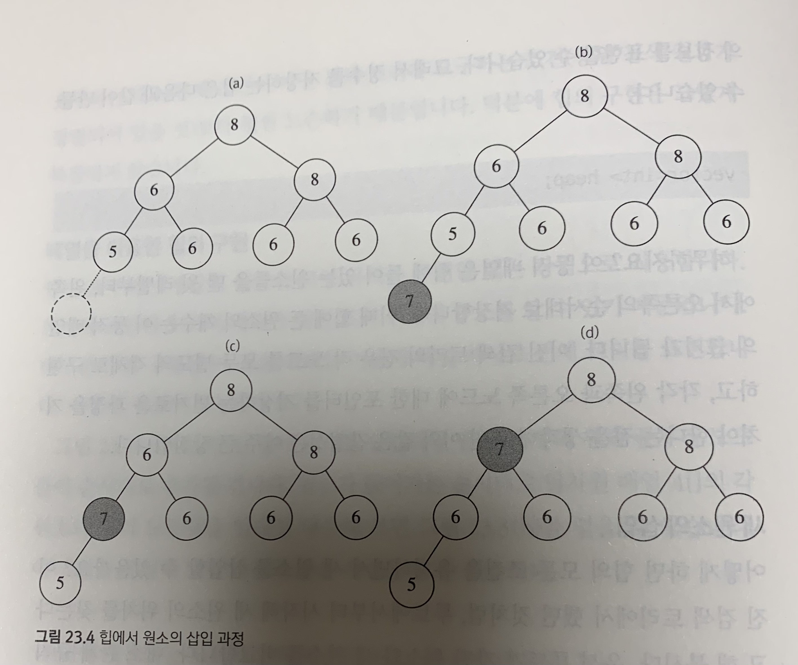
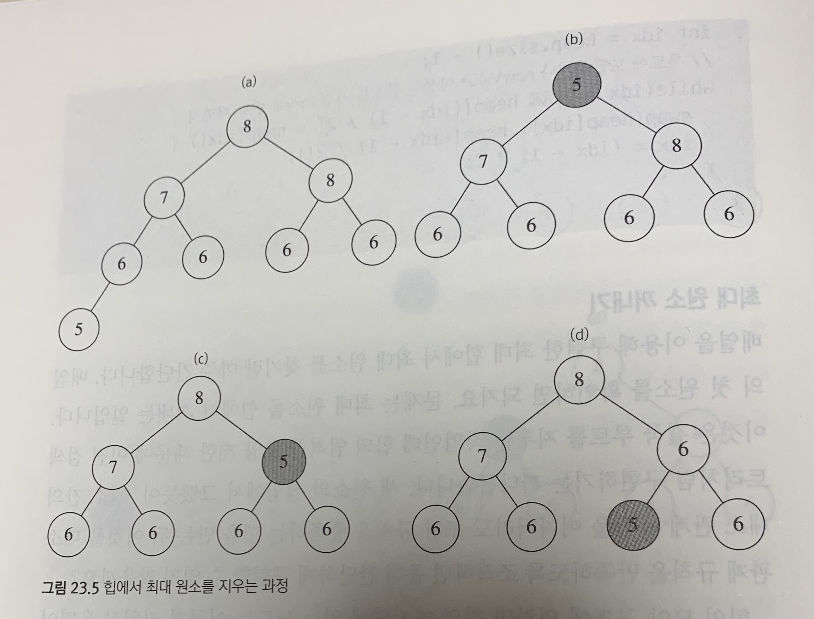
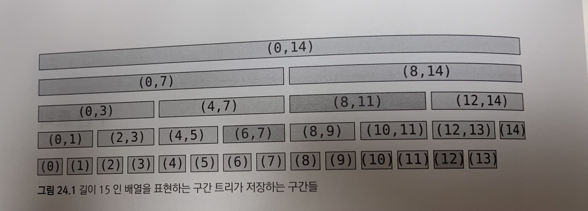
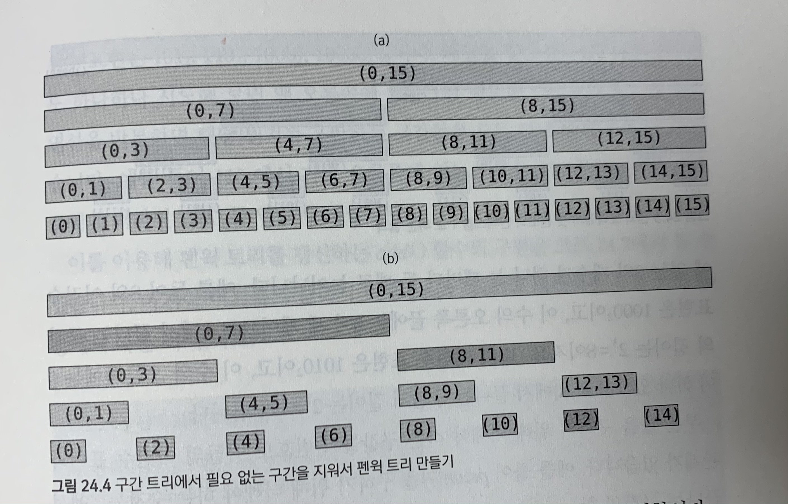
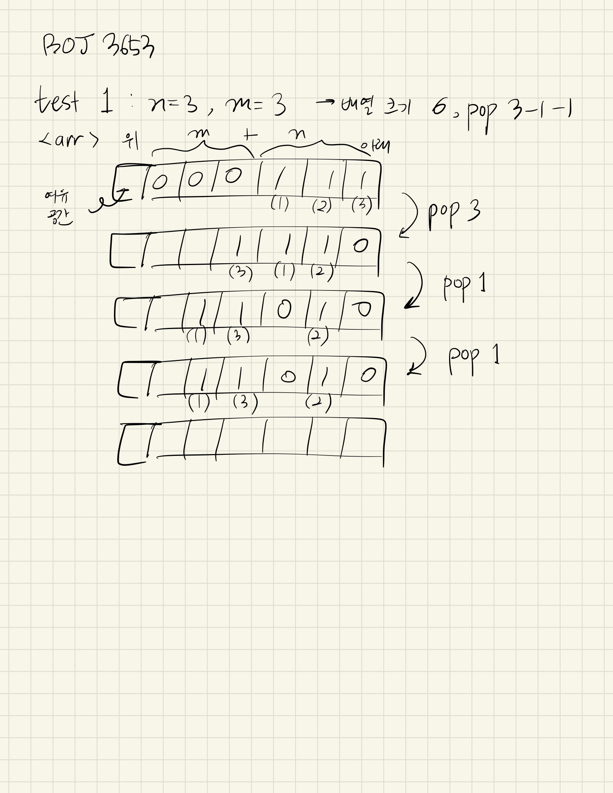
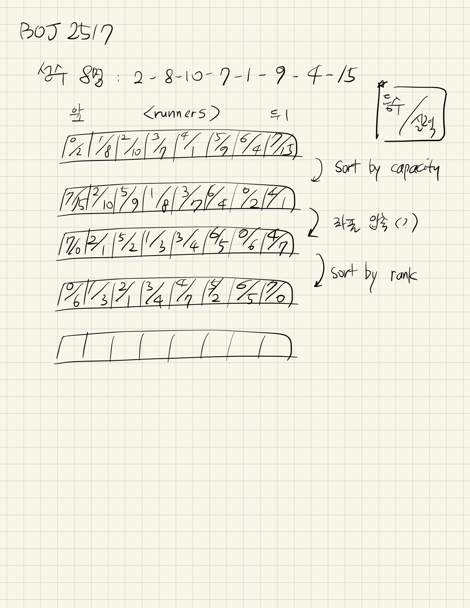

# ch23-24 - 백준 문제 풀이

by | 지은   
pub date | 2021.02.06.Sat

### 우선순위 큐와 힙  
- 이진 검색 트리 대신 힙(heap)을 이용, 가장 큰 원소 찾기  
- `O(logN)` 시간에 수행  

**힙의 정의와 구현**  
- 힙의 대소 관계 규칙: 부모 노드가 가진 원소는 항상 자식 노드가 가진 원소 이상 (최대 힙)  
- 모양 규칙을 만족하는 힙의 높이는 `O(logN)`  

**배열을 이용한 힙의 구현**  
```c++
vector<int> heap;
```
힙의 원소들을 맨 윗 레벨부터, 왼쪽에서 오른쪽의 순서대로 저장  

**새 원소의 삽입**  
1. 모양 규칙 맞추기 - 새 노드가 트리의 어느 쪽에 생겨나야 하는지?  
2. 대소 관계 맞추기 - 마지막에 추가한 새 원소를 자신의 부모 노드가 가진 원소와 비교해 나가기
  

**최대 원소 꺼내기**  
1. 마지막 노드로 루트를 덮어 씌우기  
2. 두 자식 중 더 큰 원소를 갖는 노드와 원소 교환 반복

  
### 구간 트리  
- 일차원 배열의 특정 구간에 대한 문제  
- 주어진 배열의 구간들을 표현하는 이진 트리 만들기  
- 노드마다 해당 구간에 대한 계산 결과 저장 (전처리)
  

**구간 트리의 표현**  
- 이진 트리를 배열로 표현  

**구간 트리의 초기화**  
- 각 노드마다 해당 구간의 최소치 계산  

**구간 트리의 질의 처리**  
- 임의의 구간에서의 최소치  
`query(left, right, node, nodeLeft, nodeRight)`  
- `O(logN)` 소요

**구간 트리의 갱신**  
- 위치를 포함하는 구간들만 재계산  

### 펜윅 트리: 빠르고 간단한 구간 합  
- 구간 합 대신 부분 합만을 빠르게 계산하는 자료구조  
```
[i, j] 구간의 합은 sum[j]-sum[i-1]
``` 
  
- 각 구간의 번호를 이진수로 표현      

### BOJ1766
```c++
#include <iostream>
#include <vector>
#include <queue>

using namespace std;

const int MAX = 32000 + 1;
int inDegree[MAX];
vector<int> nums[MAX];
priority_queue<int, vector<int>, greater<int> > pq; // 작은 수부터 pop

int main() {
    int n, m;
    cin >> n >> m;
    for (int i=0; i<m; i++) {
        int a, b;
        cin >> a >> b;
        inDegree[b]++; // inDegree[b] = b보다 먼저 풀어야 하는 문제의 개수
        nums[a].push_back(b);
    }
    for (int i=1; i<=n; i++) {
        if (inDegree[i] == 0) { // 먼저 풀어야 할 문제가 있는 나중 문제는 pq에 넣지 않음
            pq.push(i);
        }
    }
    while (!pq.empty()) {
        int curr = pq.top(); // 문제 번호가 작은 것(쉬운 것)부터 출력
        pq.pop();

        cout << curr << " ";
        for (int i=0; i<nums[curr].size(); i++) {
            int next = nums[curr][i]; // curr보다 나중에 풀어야 하는 문제
            // 출력 초과 (테케는 통과)
//            if (inDegree[next] > 0) { // 먼저 풀어야 하는 문제가 있다면
//                pq.push(next); // pq에 넣어주고
//                inDegree[next]--; // inDegree에서는 배줌
//            }
            if (--inDegree[next] == 0) {
                pq.push(next);
            }
        }
    }
}
```

### BOJ1781
```c++
// 그리디 알고라즘, 우선순위 큐 이용
// 1. 데드라인 기준으로 내림차순 정렬
// 2. 데드라인 기준으로 우선순위 큐(힙)에 담기
#include <iostream>
#include <vector>
#include <queue>
#include <algorithm>

using namespace std;

vector<pair<int, int> > v; // pair<데드라인, 컵라면>
priority_queue<int> pq;
int ret;

int main() {
    int n;
    cin >> n;
    for (int i=0; i<n; i++) {
        int d, r;
        cin >> d >> r;
        v.push_back(make_pair(d, r));
        v[i].first--; // 인덱싱 편하게 하기 위해서 (0~n-1로 접근하기 위해서)
    }
    // 데드라인 순으로 오름차순 정렬 (밑의 for문에서 뒤에서부터 접근할 예정)
    sort(v.begin(), v.end());
    int j = n-1; // 한 번씩만 체크하여 큐에 담기 위해서

    for (int i=n-1; i>=0; i--) { // 뒤에서부터(데드라인이 긴 것부터) 시작
        // 같은 데드라인의 문제들 (v[j].first == i)
        // ** 각 문제의 데드라인은 N 이하의 자연수 (i에 해당하는 데드라인이 없으면 그냥 무시)
        for (; j>=0 && v[j].first==i; j--) {
            pq.push(v[j].second); // 라면 담기 
        }
        if (!pq.empty()) {
            ret += pq.top(); // 1초(i가 한 번 순회할 때)에 하나씩 가능한 목록 중 가장 많은 컵라면의 수를 더함
            pq.pop();
        }
    }

    cout << ret;
}

```
### BOJ3653
```c++
// https://www.acmicpc.net/blog/view/9
// 시간 초과?

#include <iostream>
#include <vector>

using namespace std;

vector<int> tree, arr;

// arr[idx] = diff로 바뀔 때 node를 루트로 하는 구간 트리를 갱신하고 노드가 표현하는 구간의 최소치를 반환
void update(int node, int start, int end, int idx, int diff) {
    if (idx < start || idx > end) return; // 범위 밖
    tree[node] += diff;
    if (start^end) { // bit xor 연산자 - 둘 중에 하나만 1일 때만 1 -> 리프 노드인지 검사
        update(node*2, start, (start+end)/2, idx, diff); // 왼쪽 구간 업데이트
        update(node*2+1, (start+end)/2+1, end, idx, diff); // 오른쪽 구간 업데이트
    }
}

// node가 담당하는 구간이 start~end이고, 구해야하는 합의 범위는 left~right
int sum(int node, int start, int end, int left, int right) {
    if (left > end || right < start) { // 범위 밖
        return 0; // 아무것도 더하지 않음
    }
    if (left <= start && end <= right) {
        return tree[node]; // 리프 노드
    }
    // 좌우 자식 트리로 나눠서 탐색
    return sum(node*2, start, (start+end)/2, left, right) + sum(node*2+1, (start+end)/2+1, end, left, right);
}

int main() {
    int t;
    cin >> t;
    while (t--) {
        int n, m;
        cin >> n >> m;
        arr = vector<int>(n+m+1);
        tree = vector<int>(4*(n+m+1)); // 트리의 크기를 넉넉하게

        for (int i=m+1; i<=n+m; i++) { // 배열의 뒤쪽만 일단 채워줌
            update(1, 1, n+m, i, 1); // 1을 루트로 하는 트리의 i번째 노드에 1을 저장(dvd 유)
            arr[i-m] = i; // arr에도 dvd를 저장 (i-m은 항상 1 - dvd의 존재 여부만 저장)
        }
        int idx = m; // 초기의 m의 위치는 m번째 인덱스

        for (int i=0; i<m; i++) { // 아직 비어 있는 임시 칸들
            int v;
            cin >> v;
            cout << sum(1, 1, n+m, 1, arr[v]-1) << " "; // 현재 칸 왼쪽(위쪽)으로 몇 개의 dvd가 있는지
            update(1, 1, n+m, arr[v], -1); // arr[v]에서 dvd를 빼줌
            arr[v] = idx--; // arr에서 v의 위치는 점점 앞으로(=위로)
            update(1, 1, n+m, arr[v], 1); // 바뀐 노드를 tree에도 업데이트
        }
        cout << "\n";
    }
}
```

  
### BOJ2517
```c++
// https://jaimemin.tistory.com/1476
// https://kibbomi.tistory.com/159

// i번째 선수에 대하여, 그 사람보다 앞에 있는 사람들 즉 (0, i) 구간의 사람들 중
// 자신보다 능력이 높은 사람의 수 + 1 = 본인의 최선의 등수

#include <iostream>
#include <vector>
#include <algorithm>
#include <cmath>

using namespace std;

const int MAX = 500001; // input이 너무 큼. for loop을 사용하면 시간복잡도 N^2

vector<pair<int, int> > runners; // pair<rank, capacity>
vector<int> tree;

bool comp_capacity(pair<int, int> a, pair<int, int> b) {
    return a.second > b.second; // 살력이 좋은 순으로 정렬
}

bool comp_rank(pair<int, int> a, pair<int, int> b) {
    return a.first < b.first; // 등수가 낮은 순으로 정렬
}

// 자신보다 앞서 뛴 선수들 중 자기보다 실력이 안 좋은 선수들의 수를 확인한 뒤 등수를 출력
int query(int node, int start, int end, int left, int right) {
    if (left > end || right < start) { // 범위 밖
        return 0; // 아무것도 더하지 않음
    }
    if (left <= start && end <= right) {
        return tree[node]; // 리프 노드
    }
    // 좌우 자식 트리로 나눠서 탐색
    return query(node*2, start, (start+end)/2, left, right) + query(node*2+1, (start+end)/2+1, end, left, right);
}

// 현재 선수의 실력 업데이트
int update(int node, int start, int end, int idx) {
    if (idx < start || idx > end) return tree[node]; // 범위 밖이면 값 업데이트 없이 그냥 리턴
    if (start == end) { // 범위에 포함되는 리프 노드라면
        tree[node] += 1; // 1 더하고 해당 노드 리턴
        return tree[node];
    }
    return tree[node] = update(node*2, start, (start+end)/2, idx) + update(node*2+1, (start+end)/2+1, end, idx); // 왼쪽, 오른쪽 구간 업데이트
}

int main() {
    int n;
    cin >> n;
    runners.resize(n);

    for (int i=0; i<n; i++) {
        runners[i].first = i; // rank
        cin >> runners[i].second;
    }
    sort(runners.begin(), runners.end(), comp_capacity); // 실력이 큰 순으로 정렬

    // 좌표 압축 - 상대적인 능력에 따라 배치
    for (int i=0; i<n; i++) {
        runners[i].second = i; // 능력이 가장 높은 사람의 순서가 제일 뒤로 밀려남
    }
    sort(runners.begin(), runners.end(), comp_rank); // 등수가 작은 순으로 정렬

    int h = (int)ceil(log2(n)); // segment tree 높이 계산
    int tree_size = 1 << (h+1); // *4
    tree = vector<int>(tree_size);

    for (int i=0; i<n; i++) {
        int front = 0;
        front = query(1, 0, n-1, 0, runners[i].second); // 내 앞에 몇 명 있는지?
        cout << front+1 << "\n"; // 0부터 인덱싱했으므로 1 더해서 출력
        update(1, 0, n-1, runners[i].second); // 트리 업데이트
    }
}
```

