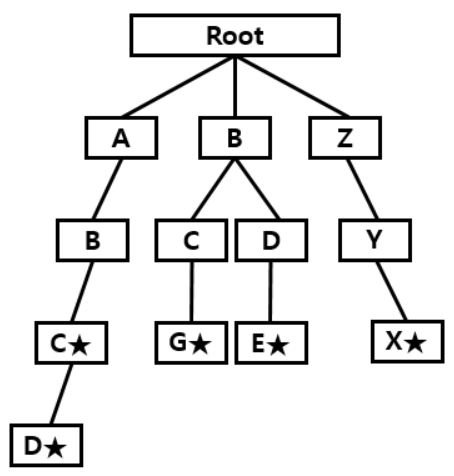
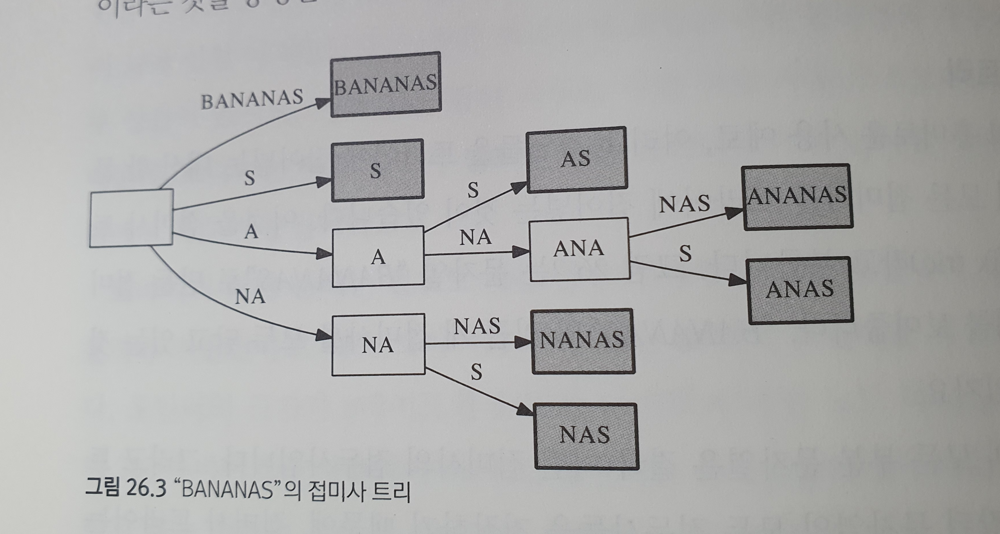

# ch25-25 - 백준 문제 풀이

by | 상원   
pub date | 2021.02.22.Mon

## 상호 배타적 집합 Disjoint Set

종만북 내용에 따르면

- 배열로 표현
  - 찾기 연산 O(1)
  - 합치기 연산 O(n)
- 트리로 표현
  - 찾기 연산 O(height-of-the-tree)
  - 합치기 연산 O(height-of-the-tree)


아래 두 문제는 집합의 원소가 순차적인 숫자로 주어짐 -> 배열로 구현하는 것이 간단

### BOJ1717

#### 문제

초기에 {0}, {1}, {2}, ... {n} 이 각각 n+1개의 집합을 이루고 있다. 여기에 합집합 연산과, 두 원소가 같은 집합에 포함되어 있는지를 확인하는 연산을 수행하려고 한다.

집합을 표현하는 프로그램을 작성하시오.

#### 입력

첫째 줄에 n(1 ≤ n ≤ 1,000,000), m(1 ≤ m ≤ 100,000)이 주어진다. m은 입력으로 주어지는 연산의 개수이다. 다음 m개의 줄에는 각각의 연산이 주어진다. 합집합은 0 a b의 형태로 입력이 주어진다. 이는 a가 포함되어 있는 집합과, b가 포함되어 있는 집합을 합친다는 의미이다. 두 원소가 같은 집합에 포함되어 있는지를 확인하는 연산은 1 a b의 형태로 입력이 주어진다. 이는 a와 b가 같은 집합에 포함되어 있는지를 확인하는 연산이다. a와 b는 n 이하의 자연수 또는 0이며 같을 수도 있다.

#### 출력

1로 시작하는 입력에 대해서 한 줄에 하나씩 YES/NO로 결과를 출력한다. (yes/no 를 출력해도 된다)

#### 풀이

- 순차적으로 배열된 숫자들을 이용해 disjoint set 을 구현
- find 의 시간 복잡도는 최선의 경우 O(1), 최악의 경우 O(n) -> recursion error 방지
- union 의 시간 복잡도는 find의 시간 복잡도에 비례
- 파이썬 리스트의 대입 연산은 O(1)

```python
import sys

input = sys.stdin.readline

sys.setrecursionlimit(1000000) # 1 ≤ n ≤ 1,000,000
# 최악의 경우 뒤에서부터 2개씩 바꾸며 앞으로 내려오고, find(1000000)을 하면 
# recursion 이 1000000 번 일어난다

n, m = map(int, input().split())
parent = [i for i in range(n+1)]

def find(target):
    if target == parent[target]:
        return target
    
    # 자신이 속한 그룹의 번호로 해당 위치의 수를 바꾼다. recursion
    parent[target] = find(parent[target])
    return parent[target]

def union(a, b):
    a = find(a)
    b = find(b)
    
    # 작은 쪽이 부모, 가장 작은 번호가 해당 집합의 번호
    if a < b:
        parent[b] = a
    else:
        parent[a] = b
    

for _ in range(m):
    code, a, b = map(int, input().split())
    if code == 0:
        union(a, b)
    else:
        if find(a) == find(b):
            print('YES')
        else:
            print('NO')
```


#### BOJ1976

#### 문제

동혁이는 친구들과 함께 여행을 가려고 한다. 한국에는 도시가 N개 있고 임의의 두 도시 사이에 길이 있을 수도, 없을 수도 있다. 동혁이의 여행 일정이 주어졌을 때, 이 여행 경로가 가능한 것인지 알아보자. 물론 중간에 다른 도시를 경유해서 여행을 할 수도 있다. 예를 들어 도시가 5개 있고, A-B, B-C, A-D, B-D, E-A의 길이 있고, 동혁이의 여행 계획이 E C B C D 라면 E-A-B-C-B-C-B-D라는 여행경로를 통해 목적을 달성할 수 있다.

도시들의 개수와 도시들 간의 연결 여부가 주어져 있고, 동혁이의 여행 계획에 속한 도시들이 순서대로 주어졌을 때 가능한지 여부를 판별하는 프로그램을 작성하시오. 같은 도시를 여러 번 방문하는 것도 가능하다.

#### 입력

첫 줄에 도시의 수 N이 주어진다. N은 200이하이다. 둘째 줄에 여행 계획에 속한 도시들의 수 M이 주어진다. M은 1000이하이다. 다음 N개의 줄에는 N개의 정수가 주어진다. i번째 줄의 j번째 수는 i번 도시와 j번 도시의 연결 정보를 의미한다. 1이면 연결된 것이고 0이면 연결이 되지 않은 것이다. A와 B가 연결되었으면 B와 A도 연결되어 있다. 마지막 줄에는 여행 계획이 주어진다. 도시의 번호는 1부터 N까지 차례대로 매겨져 있다.

#### 출력

첫 줄에 가능하면 YES 불가능하면 NO를 출력한다.

#### 풀이

- 위 문제와 거의 비슷

```python
import sys

input = sys.stdin.readline

n_of_cities = int(input())
n_in_plan = int(input())

parent = [i for i in range(n_of_cities)]

def find(target):
    if target == parent[target]:
        return target
    
    # 자신이 속한 그룹의 번호로 해당 위치의 수를 바꾼다.
    parent[target] = find(parent[target])
    return parent[target]

def union(a, b):
    a = find(a)
    b = find(b)
    
    # 작은 쪽이 부모, 가장 작은 번호가 해당 집합의 번호
    if a < b:
        parent[b] = a
    else:
        parent[a] = b

        
for i in range(n_of_cities):
    # 순회하며 index 와 값을 동시에 반환하는 enumerate 사용 
    for j, is_connected in enumerate(map(int, input().split())):
        if is_connected == 1:
            union(i, j)
            
temp = None
for i in map(int, input().split()):
    if temp == None:
        temp = find(i-1)
    else:
        if temp != find(i-1):
            print("NO")
            break
else:
    print("YES")
```


## 트라이 Trie  

- 문자열 집합을 효율적으로 저장하기 위한 자료 구조

- 각 노드에 저장되는 정보는 
  1. 자기 자신의 알파벳
  2. 자손 노드를 가리키는 포인터
  3. 종료 노드인지 판단하는 boolean 값


#### 시간 복잡도

- find() : 문자열의 길이 M에 선형 비례 O(M)
- insert() : 문자열의 길이 M에 선형 비례 O(M)



#### 참고. 접미사 트리



- 모든 접미사를 data 로 가지는 접미사 트라이는 너무 많은 메모리를 차지한다.
- 각 간선이 문제열의 한 글자가 아니라, 여러 글자에 대응되도록 한다.
- 그러나 시간 복잡도가 간단히 구현할 경우 O(N^2), 잘 안쓴다.


#### BOJ5052

#### 문제

전화번호 목록이 주어진다. 이때, 이 목록이 일관성이 있는지 없는지를 구하는 프로그램을 작성하시오.

전화번호 목록이 일관성을 유지하려면, 한 번호가 다른 번호의 접두어인 경우가 없어야 한다.

예를 들어, 전화번호 목록이 아래와 같은 경우를 생각해보자

- 긴급전화: 911
- 상근: 97 625 999
- 선영: 91 12 54 26

이 경우에 선영이에게 전화를 걸 수 있는 방법이 없다. 전화기를 들고 선영이 번호의 처음 세 자리를 누르는 순간 바로 긴급전화가 걸리기 때문이다. 따라서, 이 목록은 일관성이 없는 목록이다. 

#### 입력

첫째 줄에 테스트 케이스의 개수 t가 주어진다. (1 ≤ t ≤ 50) 각 테스트 케이스의 첫째 줄에는 전화번호의 수 n이 주어진다. (1 ≤ n ≤ 10000) 다음 n개의 줄에는 목록에 포함되어 있는 전화번호가 하나씩 주어진다. 전화번호의 길이는 길어야 10자리이며, 목록에 있는 두 전화번호가 같은 경우는 없다.

#### 출력

각 테스트 케이스에 대해서, 일관성 있는 목록인 경우에는 YES, 아닌 경우에는 NO를 출력한다.

#### 풀이

- 종료 노드인지 판단하는 boolean 값을 구현하지 않음, 대신 children 이 비어있는지를 검사(비어 있으면 종료 노드)

- 역으로 정렬하는 코드 사용, 다음 문자열이 바로 직전 문자열의 접두사인지 판단

  ```
  // 정렬 전
  134
  15
  12
  134
  1234
  ```

  ```
  // 정렬 후 (문자열 역순)
  15
  134
  13
  1234
  12
  ```

```python
import sys

input = sys.stdin.readline

class Node:
    def __init__(self, key, data=None):
        self.key = key
        self.data = data
        self.children = {}
        
class Trie:
    def __init__(self):
        self.head = Node(None)
    
    def insert(self, string):
        cur_node = self.head
        
        for char in string:
            # cur_node 의 자손중에 없으면 새로 노드 생성
            if char not in cur_node.children:
                cur_node.children[char] = Node(char)
                
            cur_node = cur_node.children[char]
        
        if cur_node.children == {}:
            return True
        else:
            return False
        
        
n_of_test_case = int(input())

for _ in range(n_of_test_case):
    n_of_number = int(input())
    numbers = []
    for _ in range(n_of_number):
        numbers.append(input().strip())
    # 역으로 정렬
    numbers.sort(reverse=True)
    
    trie = Trie()
    for number in numbers:
        if trie.insert(number) == False:
            print('NO')
            break
    else:
        print('YES')
```


#### BOJ14725

#### 입력

첫 번째 줄은 로봇 개미가 각 층을 따라 내려오면서 알게 된 먹이의 정보 개수 N개가 주어진다.  (1 ≤ N ≤ 1000)

두 번째 줄부터 N+1 번째 줄까지, 각 줄의 시작은 로봇 개미 한마리가 보내준 먹이 정보 개수 K가 주어진다. (1 ≤ K ≤ 15)

다음 K개의 입력은 로봇 개미가 왼쪽부터 순서대로 각 층마다 지나온 방에 있는 먹이 정보이며 먹이 이름 길이 t는 (1 ≤ t ≤ 15) 이다. 

#### 출력

개미굴의 시각화된 구조를 출력하여라.

개미굴의 각 층을 "--" 로 구분하며, 같은 층에 여러개의 방이 있을 때에는 사전 순서가 앞서는 먹이 정보가 먼저 나온다.

#### 풀이

- node에 트라이에서 현재 층을 저장하는 level 을 추가, 이를 활용해 print() 메서드 구현

```python
import sys

input = sys.stdin.readline

class Node:
    def __init__(self, key, level=0):
        self.key = key
        self.level = level
        self.children = {}
        
class Trie:
    def __init__(self):
        self.head = Node(None)
    
    def insert(self, lst):
        cur_node = self.head
        
        for i, elem in enumerate(lst):
            # cur_node 의 자손중에 없으면 새로 노드 생성
            if elem not in cur_node.children:
                cur_node.children[elem] = Node(key=elem, level=i)
                
            cur_node = cur_node.children[elem]
    
    def print(self):
        self.__print_rec(self.head)
            
    def __print_rec(self, cur_node):
        if cur_node.key is not None:
            print("--" * cur_node.level + cur_node.key)
        
        for child in sorted(cur_node.children):
            self.__print_rec(cur_node.children[child])
        
        
        
n_of_info = int(input())

trie = Trie()

for _ in range(n_of_info):
    temp = input().strip().split()
    n_of_foods = temp[0]
    foods = temp[1:]

    trie.insert(foods)
    
trie.print()
```

