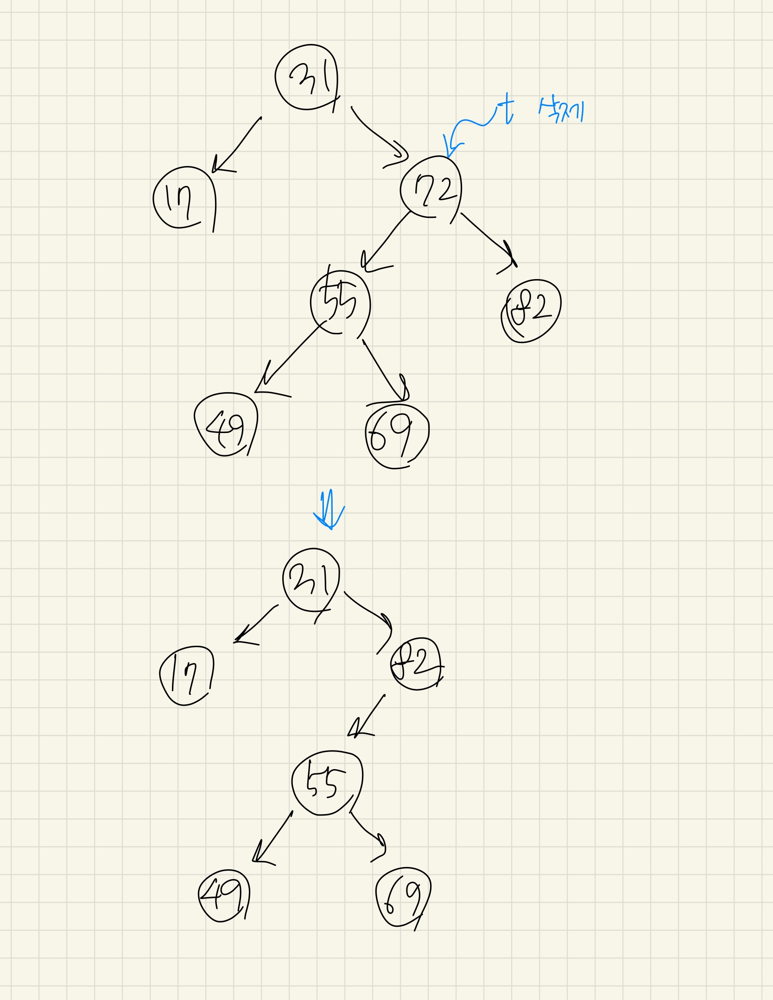

## Lecture 22: 이진 검색 트리
by | 지은  
pub date | 2020.10.17.Sat

---

### 이진 검색 트리의 정의와 조작
각 노드가 왼/오 최대 두 개의 자식 노드만을 가질 수 있는 트리   
각 노드의 왼쪽 서브트리에는 해당 노드의 원소보다 작은 원소를 가진 노드들, 
오른쪽 서브트리에는 해당 노드의 원소보다 큰 원소를 가진 노드들  

**순회**
이진 검색 트리를 중위 순회 - 크기 순서로 정렬된 원소의 목록
👉 최소 원소나 최대 원소를 쉽게 얻을 수 있음
 
**자료의 검색**
한 번 원소를 비교하는 것만으로도 찾아야 할 전체 대상의 절반 감소

**조작**
- 원소의 삽입: 새 원소가 들어갈 위치를 찾고 거기에 노드를 추가  
- 원소의 삭제: '합치기' 연산 - `노드 t`를 지운다면, `t`의 두 서브트리를 합친 새로운 트리를 만든 뒤 이 트리를 `t`를 루트로 하는 서브트리와 바꿔치기

🤔 이것도 가능하지 않은지?   


🤔 아니면 1)right subtree의 child 중 min node나 2) left subtree의 child 중 max node(leaf 노드)와 현재 삭제할 노드를 바꿔치기 후 순서대로 정렬  
[ref1](https://www.geeksforgeeks.org/binary-search-tree-set-2-delete/)  
[ref2](https://codingstarter.tistory.com/20)   
  
**X보다 작은 원소의 수 찾기/ k번째 원소 찾기**  
...

---

### 시간 복잡도 분석과 균형 잡힌 이진 검색 트리
모든 연산의 시간 복잡도는 트리의 높이 `O(h)`

균형 잡힌 이진 검색 트리: 트리의 구조에 제약 추가, 노드들을 옮겨서 트리의 높이를 항상 `O(logN)`으로 유지  
ex) 레드-블랙 트리  

---

### 문제: 너드인가, 너드가 아닌가? 2
새롭게 주어진 점 q에 대하여 오른쪽에 있는 점만을 확안하여 해당 점의 지배 여부를 파악  
[code 22-1](https://github.com/snulion-study/algorithm-int/blob/jieun/jieun/lec_21-22/22-1/22-1.cpp)    
`O(NlogN)` 소요

---

### 균형 잡힌 이진 검색 트리 직접 구현하기: 트립(tree + heap)

**트립의 정의**
일종의 랜덤화된 이진 검색 트리
트리의 형태가 난수에 의해 임의대로 결정됨
새 노드가 추가될 때마다 해당 노드에 우선순위(priority) 부여(난수)
항상 부모의 우선순위가 자식의 우선순위보다 높은 이진 검색 트리
- 이진 검색 트리의 조건
- 힙의 조건: 모든 노드의 우선순위는 각자의 자식 노드보다 크거나 같음

우선순위가 높을수록 위에 간다는 제약을 추가하면, 결과적으로 우선순위 순서대로 노드를 추가한 이진 검색 트리가 됨 

**트립의 높이**
완벽히 균형잡힌 이진 검색 트리에서는 트리를 한 단계 내려갈 때마다 후보의 수가 대략 절반으로 줄어듦 ➡️ `O(logN)` 시간  
트립의 루트는 N개의 노드 중 최대의 우선순위를 갖는 노드  
한 단계 내려갈 떄마다 후보의 수가 평균적으로 2/3만큼 줄어듦  

**트립의 구현**  
[code 22-3](https://github.com/snulion-study/algorithm-int/blob/jieun/jieun/lec_21-22/22-3/22-3.cpp)  

**노드의 추가와 '쪼개기' 연산**  
문제 😯 새 node의 우선순위가 root보다 높은 경우
👉 기존의 트리를 node가 가진 원소를 기준으로 '쪼개는' 것 
🤯 잘 모르겠음    
[code 22-3](https://github.com/snulion-study/algorithm-int/blob/jieun/jieun/lec_21-22/22-3/22-3.cpp)  

**노드의 삭제와 '합치기' 연산**
두 서브트리를 합칠 때 어느 쪽이 루트가 되어야 하는지를 우선순위를 통해 판단!  
[code 22-3](https://github.com/snulion-study/algorithm-int/blob/jieun/jieun/lec_21-22/22-3/22-3.cpp)  

**k번째 원소 찾기**
각 서브트리의 크기를 통해 k번째 노드 찾기
- k가 루트의 왼쪽 서브트리에 있는 경우
- k가 루트인 경우
- k가 루트의 오른쪽 서브트리에 있는 경우  
😮 다른 종류의 이진 검색 트리에도 사용 가능!   
[code 22-3](https://github.com/snulion-study/algorithm-int/blob/jieun/jieun/lec_21-22/22-3/22-3.cpp)  

**x보다 작은 원소 세기**  
특정 범위 [a, b)가 주어질 때 이 범위 안에 들어가 있는 원소들의 숫자 계산  
: `countLessThan(b) - countLessThan(a)`   
[code 22-3](https://github.com/snulion-study/algorithm-int/blob/jieun/jieun/lec_21-22/22-3/22-3.cpp)   

---

**문제: 삽입 정렬 뒤집기**    
🤪[삽입 정렬 graphic](https://visualgo.net/en/sorting)  

```c++

  void insertionSort(vector<int>& A) {
    for (int i=0; i<A.size(); ++i) {
      int j = i;
      while (j>0 && A[j-1] > A[j]) {
        swap(A[j-1]), A[j];
        j--;
      }
    } 
  }

```
[code 22-3](https://github.com/snulion-study/algorithm-int/blob/jieun/jieun/lec_21-22/22-3/22-3.cpp)  
