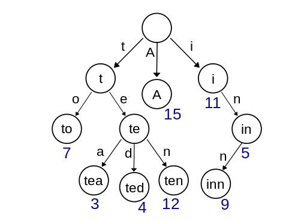

# **Lecture 26: 트라이**

by | 혜민

pub date | 2020.11.07.Sat

### **트라이**

- 문자열을 다룰 때는 다른 정수, 실수 등의 자료형과 다르게 시간 복잡도가 O(MlogN) (M:문자열의 최대 길이, N:원소의 갯수)
- 이와 같은 시간 복잡도 문제를 해결하기 위해 고안된 자료 구조가 **트라이(trie)**



트라이의 중요한 속성
- 한 노드까지 따라가는 경로에서 만나는 글자들을 모으면 해당 노드에 대응되는 접두사 -> 대응되는 문자열을 저장할 필요 없음
- 트라이의 한 노드는 자손 노드를 가리키는 `포인터 목록 children[ALPHABET]` 종료 노드인지를 가리키는 `terminal` 변수로 구성

#### 트라이의 구현
  
[코드 26.1](../hyemin/26_Trie/Trie.cpp)
```c++
// 트라이의 노드를 표현하는 객체의 선언

// 알파벳 대문자를 저장하는 경우 각 노드는 26개의 자손을 가질 수 있다
const int ALPHABETS = 26;
int toNumber(char ch) { return ch - 'A'; }

// 트라이의 한 노드를 나타내는 객체
struct TrieNode {
	TrieNode* children[ALPHABETS];
	// 이 노드가 종료 노드인가?
	bool terminal;

	// 생성자
	// : (콜론)을 쓰는 이유는 초기화 리스트를 사용했기 때문
	// 초기화 리스트 : 생성자가 호출될 때 객체의 생성과 초기화가 한 번에 이루어짐
	// 생성자 함수 내에서 초기화 : 객체가 생성되어, default생성자로 초기화된 상태에서 다시 한 번 할당
	TrieNode() : terminal(false) {
		memset(children, 0, sizeof(children));
	}

	// 소멸자 : 메모리 지워준다
	~TrieNode() {
		for(int i = 0; i < ALPHABETS; i++)
			if(children[i])
				delete children[i];
	}

	// 이 노드를 루트로 하는 트라이에 문자열 key 를 추가한다.
	void insert(const char* key) {
		// 문자열이 끝나면 terminal 만 참으로 바꾸고 종료
		if(*key == 0)
			terminal = true;
		else {
			int next = toNumber(*key);
			// 해당 자식 노드가 없다면 생성한다
			if(children[next] == NULL)
				children[next] = new TrieNode();
			// 해당 자식 노드로 재귀호출
			children[next]->insert(key + 1);
		}
	}

	// 이 노드를 루트로 하는 트라이에 문자열 key 와 대응되는 노드를 찾는다.
	// 없으면 NULL 을 반환한다.
	TrieNode* find(const char* key) {
		if(*key == 0) return this;
		int next = toNumber(*key);
		if(children[next] == NULL) return NULL;
		// children[next]는 자식 trieNode의 포인터
		// 자식 tridNode struct의 find메서드 호출
		return children[next]->find(key+1);
	}
};
```
- `find()`와 `insert()` 모두 문자열의 길이만큼 재귀 호출을 수행하므로 O(M)
- 트라이의 최대 문제 : 필요로 하는 공간이 큼, 메모리를 절약하기 위한 기법들은 복잡 -> 프로그래밍 대회에서는 문자열의 개수 제한

---

#### 접미사 트라이, 접미사 트리


- **접미사 트라이** :여러 문자열들을 트라이에 집어넣는 대신 한 문자열 S의 모든 접미사를 집어넣는 트라이
- 장점 : 검색을 통해 빠르게 부분 문자열을 찾을 수 있음
- 단점 : 많은 메모리를 사용  
-> 메모리 문제를 해결하기 위해 **접미사 트리** 고안  
-> 각 간선이 문자열의 한 글자가 아닌 여러 글자에 대응되도록 함

---

#### 안녕히, 그리고 물고기는 고마웠어요!

* 문제의 핵심 : 구현보다도 **전처리**!  
-> 문자열들을 출현 빈도에 따라 내림차순으로, 같으면 사전순으로 정렬  
-> 이후 `first` 변수로 먼저 추가된 문자열을 구분하여 추천 우선순위로 정하는 것!  
(복잡한 추천 알고리즘 없이 전처리와 추가 순서로만 구현한 것이 신기했다.....)


[코드 26.2](../hyemin/26_Trie/Solong.cpp)  

```c++
// 안녕히, 그리고 물고기는 고마어요 문제를 해결하는 트라이 노드의 구현

const int ALPHABETS = 26;
int toNumber(char ch) { return ch - 'A'; }

// 트라이의 한 노드를 나타내는 객체
struct TrieNode {
	TrieNode* children[ALPHABETS];
	// 이 노드에서 종료하는 문자열의 번호, 없으면 -1
    int terminal;
    // 이 노드를 루트로 하는 트라이에 가장 먼저 추가된 단어의 번호, -1로 초기화
    int first;
    // 생성자
    TrieNode();
    // ~ : 소멸자
    ~TrieNode();
    // 이 노드를 루트로 하는 트라이에 번호 id인 문자열 key를 추가한다
    void insert(const char* key, int id) {
        // 처음 추가되는 경우(출현 빈도가 높은 경우) first를 우선 갱신
        if (first == -1) first = id;
        // 문자열이 끝났다면 terminal만 바꾸고 종료
        if (*key == 0) 
            terminal = id;
        else {
            int next = toNumber(*key);
            // 해당 자식 노드가 없다면 생성
            if (children[next] == NULL) 
                children[next] = new TrieNode();
            // 해당 자식 노드로 재귀 호출
            children[next]->insert(key+1,id);
        } // first 갱신 -> 재귀 -> 재귀 -> ... -> terminal 갱신 형태!
    }

	// 이 노드를 루트로 하는 트라이에 문자열 key 와 대응되는 노드를 찾는다.
	// 없으면 NULL 을 반환한다.
	TrieNode* find(const char* key) {
		if(*key == 0) return this;
		int next = toNumber(*key);
		if(children[next] == NULL) return NULL;
		// children[next]는 자식 trieNode의 포인터
		// 자식 tridNode struct의 find메서드 호출
		return children[next]->find(key+1);
	}
```

[코드 26.3](../hyemin/26_Trie/Solong.cpp)  

```c++
// 안녕히, 그리고 물고기는 고마웠어요 문제를 해결하는 알고리즘

    // 이 노드까지 타이핑해 왔을 때, 번호 id인 key를 타이핑하기 위해
    // 최소 몇 번의 키를 더 눌러야 하나?
    int type(const char* key, int id) {
        // 문자열 종료 시
        if (*key == 0) return 0;
        // 이 노드에서 추천되는 문자열이 이 문자열이면 탭 누르고 종료
        if (first == id) return 1;
        // 아니면 다음 문자를 타이핑
        int next = toNumber(*key);
        return 1 + children[next]->type(key + 1, id);
    }
};

// 사전을 나타내는 트라이가 주어질 때, 단어 word를 타이핑하는 데
// 몇 번이나 키를 눌러야 하는지 계산
int countKeys(TrieNode* trie, const char* word) {
    // 이 문자열이 사전에 있는지 확인하고, 있다면 번호를 구한다
    // (find는 문자열을 인풋으로 받고 그 문자열에 해당하는 노드를 리턴)
    TrieNode* node = trie->find(word);
    // 사전에 없으면 직접 타이핑할 수밖에 없다
    // 문자열의 길이만큼!
    if (node == NULL || node->terminal == -1) return strlen(word);
    // 탐색하면서 타이핑할 방법을 찾는다
    // 이 문자열은 이미 사전에 있으므로 node의 terminal이 id
    return trie->type(word, node->terminal);
}
```

[코드 26.3](../hyemin/26_Trie/Solong.cpp)  

```c++
// 안녕히, 그리고 물고기는 고마웠어요 

문제의입력을받아트라이를생성하는함수

// 입력에 주어지는 단어들을 정렬해서 트라이로 변환
TrieNode* readInput(int words) {
    // 단어들을 출현 빈도의 내림차순, 단어의 오름차순으로 정렬
    vector<pair<int,string>> input;
    for(int i = 0; i < words; ++i) {
        char buf[11];
        int freq;
        scanf("%s %d", buf, &freq);
        input.push_back(make_pair(-freq, buf));
    }
    sort(input.begin(), input.end());
    // 이때 앞에 있는 단어일수록 우선순위가 높다
    // 배열의 인덱스를 각 단어의 번호로 쓰자
    TrieNode* trie = new TrieNode();
    for(int i = 0; i < input.size(); ++i)
        trie->insert(input[i].second.c_str(), i);
    // 아무 글자도 입력하지 않으면 자동 완성이 되지 않도록 -1로 초기화
    trie->first = -1;
    return trie;
}
```

---

#### 트라이를 이용한 다중 문자열 검색


