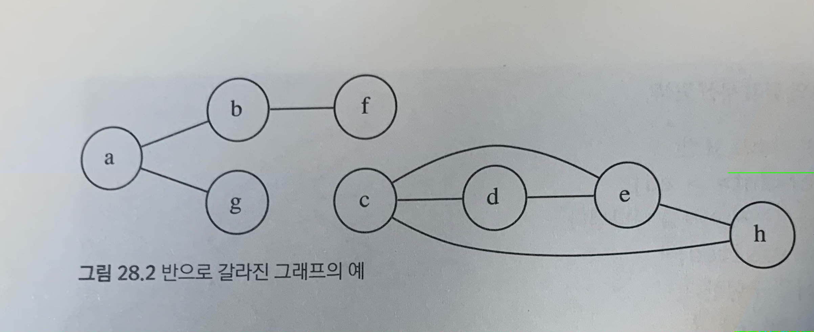
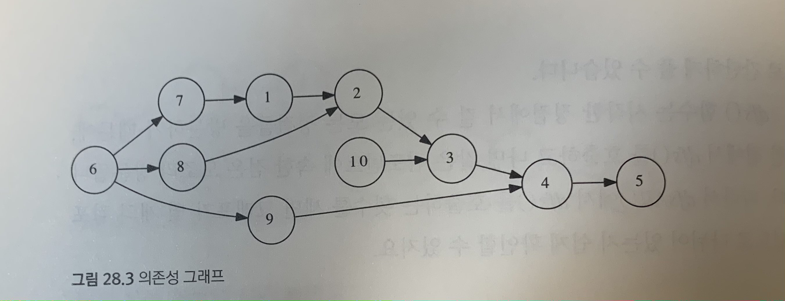
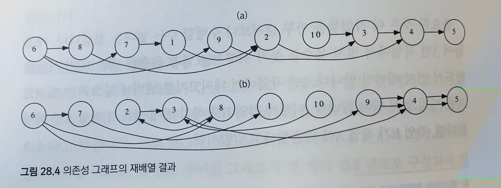
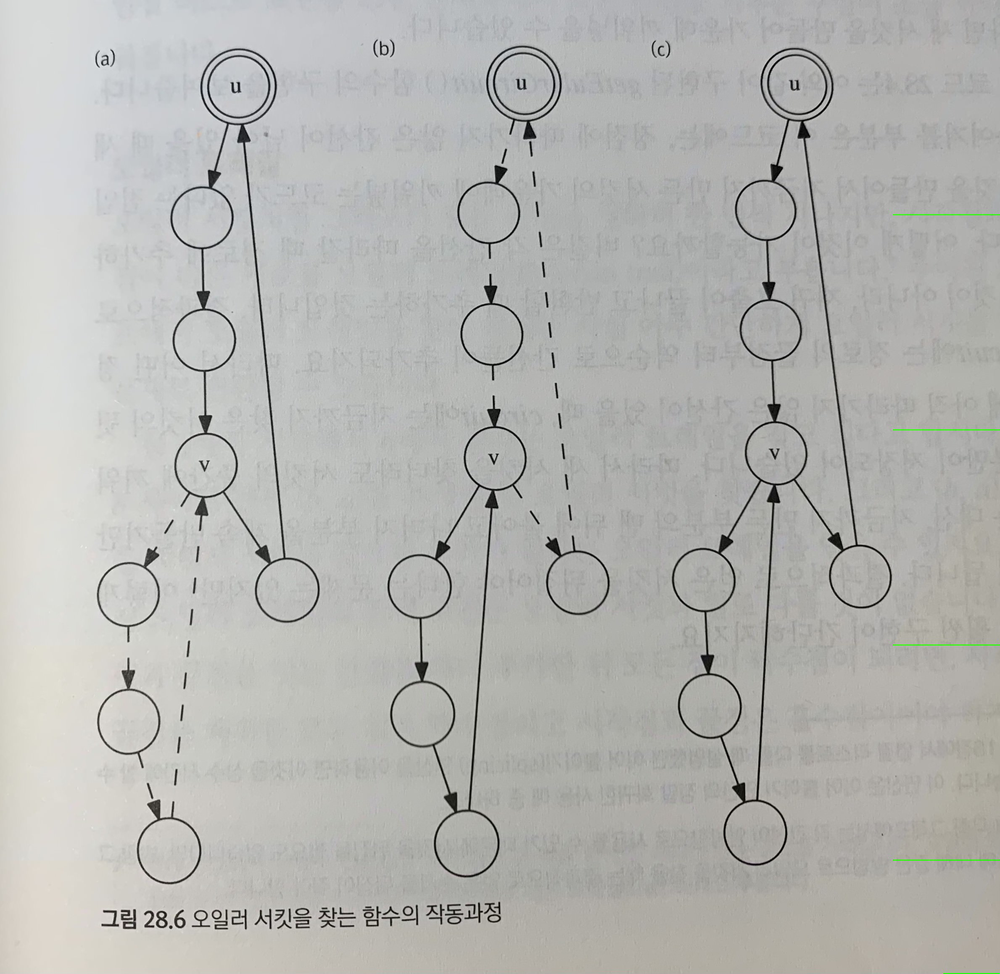
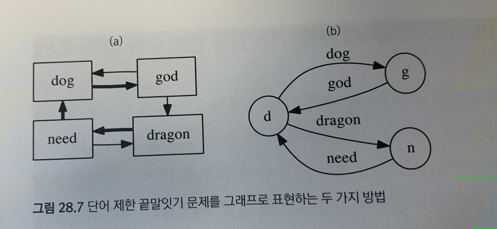
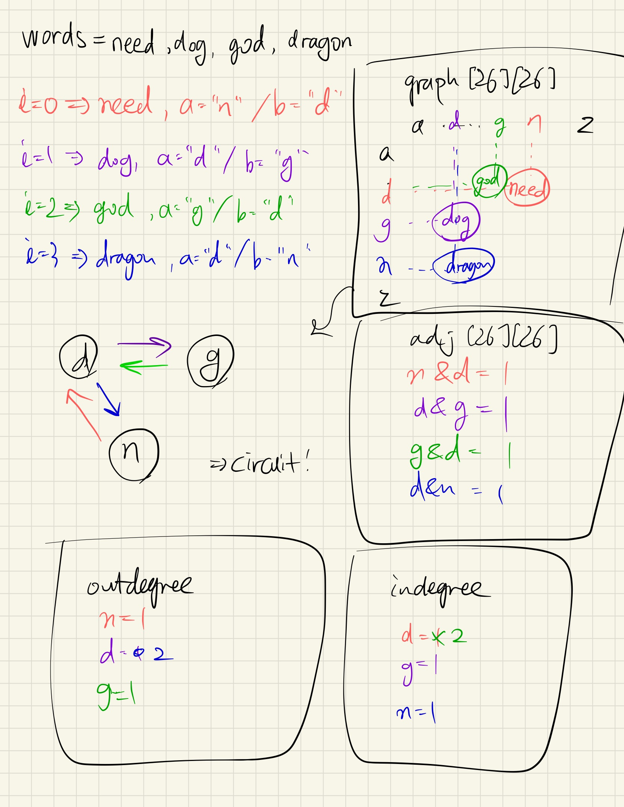
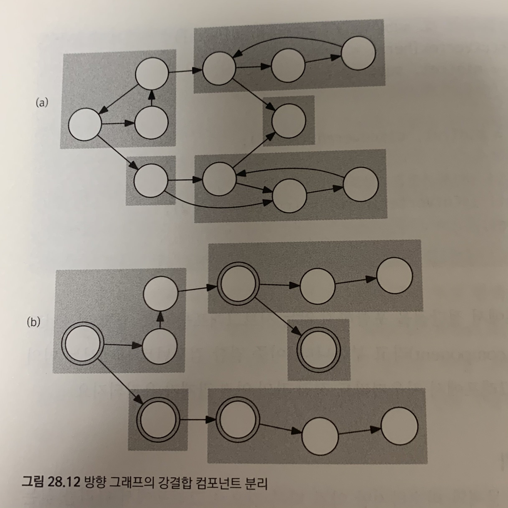

## Lecture 28. 그래프의 깊이 우선 탐색
by | 지은  
pub date | 2020.11.14.Sat

---

**그래프의 탐색 알고리즘** | 그래프의 모든 정점들을 특정한 순서에 따라 방문하는 알고리즘
**깊이 우선 탐색(DFS)** 
- 현재 정점과 인접한 간선들을 하나씩 검사하다가, 아직 방문하지 않은 정점으로 향하는 간선이 있다면 그 간선을 따라감
- 더 이상 갈 곳이 없다면 마지막에 따라왔던 간선을 따라 뒤로 돌아감
- 재귀 호출을 이용하여 지금까지 거쳐온 정점들을 모두 저장  

```c++
vector<vector<int> > adj;
vector<bool> visited;

void dfs(int here) {
    cout << "DFS visits " << here << endl;
    visited[here] = true;
    for (int i=0; i<adj[here].size(); ++i) {
        int there = adj[here][i];
        if(!visited[there]) 
            dfs(there);   
    }
}

void dfsAll() {
    // visited를 모두 false로 초기화   
    visited = vector<bool>(adj.size(), false);
    for (int i=0; i<adj.size(); ++i)
        if (!visited[i])
            dfs(i);
}
```
😮 그래프에서는 모든 정점들이 간선을 통해 연결되어 있다는 보장이 없기 때문에, `dfs()`만으로는 모든 정점을 순서대로 발견한다는 보장 X  
→ `dfsAll()` 사용하여 모든 정점 방문 필요  

**깊이 우선 탐색의 시간 복잡도**  
인접 리스트: `O(|V|+|E|)`
인접 행렬: `O(|V|^2)`

**예제: 두 정점이 서로 연결되어 있는가 확인하기**
`dfs(u)`를 수행하고 `visited[]`를 참조

**예제: 연결된 부분집합의 개수 세기**  
연결된 정점들의 부분집합 = 컴포넌트  

한 점에서 `dfs()`를 호출하고 나면 같은 컴포넌트에 속한 점은 모조리 방문됨  
→ `dfsAll()`에서 `dfs()`를 호출하는 횟수  

**예제: 위상 정렬**  
의존성이 있는 작업들의 수행 순서 계산  
의존성 그래프: 각 작업을 정점으로 표현, 작업 간 의존 관계를 간선으로 표현  
👩‍🏫 그래프에 사이클이 없는 방향 그래프, 즉 DAG!


위상 정렬의 재배열  

❗️ (b)는 오른쪽에서 왼쪽으로 가는 간선이 있으므로 틀림!  

`dfsAll()`을 수행하며 `dfs()`가 종료할 때마다 현재 정점(successor가 없는 정점)의 번호를 기록  
`dfsAll()`이 종료한 뒤 기록된 순서를 뒤집으면 위상 정렬 결과를 얻을 수 있음  
`dfs()`가 늦게 종료한 정점일수록 정렬 결과의 앞에 옴!  

✅ **ref** 자료구조 Ch15-p.35

---

### 문제: 고대어 사전  

**그래프 모델링**
두 단어를 첫 글자부터 비교하면서 처음으로 다른 글자 찾기   
방향 그래프 표현 → 그래프의 위상 정렬  

```c++
vector<vector<int> > adj;

void makeGraph(const vector<string>& words) {
    adj = vector<vector<int> >(26, vector<int>(26, 0));
    for (int j=1; j<words.size(); ++j) {
        int i = j-1, len = min(words[i].size(), words[j].size());
        // words[i]가 words[j] 앞에 오는 이유 
        for (int k=0; k<len; ++k) {
            int a = words[i][k] - 'a';
            int b = words[j][k] - 'a';
            adj[a][b] = 1;
            break;
        }
    }
}
```

**인접한 단어들만 검사하기**  
인접한 단어들만 검사하더라도 그래프의 위상 정렬 결과는 모든 단어 쌍을 검사했을 때와 같음  

**위상 정렬의 구현**  
사이클이 존재하지 않는다고 가정하고 위상 정렬을 수행  
```c++
vector<int> seen, order;
void dfs(int here) {
    seen[here] = 1;
    for (int there=0; there<adj.size(); ++there) {
        if (adj[here][there] && !seen[there])
            dfs(there);
    }
    order.push_back(here);
}

vector<int> topologicalSort() {
    int m = adj.size();
    seen = vector<int>(m, 0);
    order.clear();
    for (int i=0; i<m; ++i) if (!seen[i]) dfs(i);
    reverse(order.begin(), order.end());

    // 역방향 간선 체크 - 만약 그래프가 DAG가 아니라면 정렬 결과에 역방향 간선이 있다 → 빈 배열 반환
    for (int i=0; i<m; ++i) {
        for (int j=i+1; j<m; ++j) {
            if (adj[order[j]][order[i]])
                return vector<int>();
        }
    }
    return order;
}
```

수행 시간: 단어의 길이 `L`과 단어의 개수 `n`에 대해 `O(nL)`

---

### 오일러 서킷  
그래프의 모든 간선을 정확히 한 번씩 지나서 시작점으로 돌아오는 경로 찾기 = 한붓 그리기   
정점의 차수(degree): 한 정점에 인접한 간선의 수  
그래프의 모든 정점들이 짝수점이어야만 오일러 서킷이 존재할 수 있다!  

**오일러 서킷을 찾아내는 알고리즘**  


**깊이 우선 탐색을 이용한 구현**  
`findRandomCircuit()`을 깊이 우선 탐색처럼 재귀 호출로 구현  
```c++
vector<vector<int> > adj;

void getEulerCircuit(int here, vector<int>& circuit) {
    for (int there=0; there<adj[here].size(); ++there) {
        while(adj[here][there] > 0) {
            // 양쪽 간선을 모두 지움
            adj[here][there]--; 
            adj[there][here]--;
            getEulerCircuit(there, circuit);
        }
    }
    circuit.push_back(here);
}
```

시간 복잡도 `O(|V||E|)`  

**오일러 트레일**  
시작점과 끝점이 다른 오일러 서킷   
1. 시작점 a와 끝점 b 사이 간선 (b,a)를 추가한 뒤 오일러 서킷을 찾는다.
2. (b,a) 간선을 지워서 서킷을 끊는다. 

---

### 문제: 단어 제한 끝말잇기  

**해밀토니안 경로와 오일러 트레일** 
입력에 주어진 각 단어를 정점으로 하는 방향 그래프 만들기  
- 해밀토니안 경로: 그래프의 모든 정점을 정확히 한 번씩 지나는 경로 → 조합 탐색 (모든 정점을 일일이 방문)🤯  

👩‍🏫 각 단어를 정점이 아닌 간선으로 갖는 방향 그래프를 만들자!  
😮 이때 그래프의 정점들은 알파벳의 각 글자를 표현, 각 단어는 첫 글자에서 마지막 글자로 가는 간선  


```c++
vector<vector<int> > adj;
vector<string> graph[26][26];

vector<int> indegree, outdegree;
void makeGraph(const vector<string>& words) {
    for (int i=0; i<26; ++i) {
        for (int j=0; j<26; ++j) {
            // removes all elements from the vector
            graph[i][j].clear();
        }
    }
    adj = vector<vector<int> >(26, vector<int>(26, 0));
    indegree = outdegree = vector<int>(26, 0);

    // 각 단어를 그래프에 추가
    for (int i=0; i<words.size(); ++i) {
        int a = words[i][0] - 'a'; // 단어의 첫 번째 알파벳
        int b = words[i][words[i].size()-1] - 'a'; // 단어의 마지막 알파벳
        graph[a][b].push_back(words[i]);
        adj[a][b]++;
        outdegree[a]++;
        indegree[b]++;
    }
}

```



**방향 그래프에서의 오일러 서킷**  
각 정점에 들어오는 간선의 수와 나가는 간선의 수가 같아야야 함  

**오일러 서킷 혹은 트레일**  
if (시작점에서 나가는 간선의 수 > 들어오는 간선의 수) → 오일러 트레일  
else → 오일러 서킷  

```c++
void getEulerCircuit(int here, vector<int>& circuit) {
    for (int there=0; there<adj.size(); ++there) {
        while(adj[here][there] > 0) {
            adj[here][there]--;
            getEulerCircuit(there, circuit);
        }
    }
    circuit.push_back(here);
}

vector<int> getEulerTrailOrCircuit() {
    vector<int> circuit;

    // 시작점이 존재하는 경우는 트레일
    for (int i=0; i<26; ++i) {
        if (outdegree[i] == indegree[i]+1) {
            getEulerCircuit(i, circuit);
            return circuit;
        }
    }

    // 아니면 서킷이니, 간선에 인접한 아무 정점에서나 시작
    for (int i=0; i<26; ++i) {
        if (outdegree[i]) {
            getEulerCircuit(i, circuit);
            return circuit;
        }
    }

    return circuit;
}
```

**오일러 서킷/트레일의 존재 여부 확인**  

```c++
bool checkEuler() {
    // 예비 시작점과 끝점의 수
    int plus1 = 0, minus1 = 0;
    for (int i=0; i<26; ++i) {
        int delta = outdegree[i] - indegree[i];
        // 모든 정점의 차수는 -1, 1, 0 중 하나
        if (delta < -1 || 1 < delta) return false;
        if (delta == 1) plus1++;
        if (delta == -1) minus1--;
    }

    // 시작점과 끝점은 각 하나씩 있거나(트레일) 하나도 없어야(서킷) 한다
    return (plus1 == 1 && minus1 == 1) || (plus1 == 0 && minus1 == 0);
}

string solve(const vector<int>& words) {
    makeGraph(words);
    if (!checkEuler()) return "IMPOSSIBLE";
    vector<int> circuit = getEulerTrailOrCircuit();
    // 모든 간선을 방문하지 못했으면 실패!
    if (circuit.size() != words.size + 1) return "IMPOSSIBLE";

    reverse(circuit.begin(), circuit.end());
    string ret;
    for (int i=1; i<circuit.size(); i++) {
        int a = circuit[i-1], b = circuit[i];
        if (ret.size()) ret += " ";
        ret += graph[a][b].back();
        graph[a][b].pop_back();
    }
    return ret;
}
```

---

### 이론적 배경과 응용    
**깊이 우선 탐색과 간선의 분류**  
그래프를 깊이 우선 탐색했을 때, 탐색이 따라가는 간선들만 모아 보면 트리 형태 발견  
→ DFS 스패닝 트리  

✅ **ref** 자료구조 Ch15-p.40

- 트리 간선: 스패닝 트리에 포함된 간선  
- 순방향 간선: 스패닝 트리의 선조에서 자손으로 연결되지만 트리 간선이 아닌 간선  
- 역방향 간선: 스패닝 트리의 자손에서 선조로 연결되는 간선  
- 교차 간선: (나머지 간선들) 트리에서 선조와 자손 관계가 아닌 정점들 간에 연결된 간선들  

**예제: 위상 정렬의 정당성 증명**  
`dfs()`의 종료 역순으로 정점을 배열하므로, `dfs(u)`가 `dfs(v)`보다 일찍 종료할 경우 u에서 v로 가는 간선이 존재할 수 없다는 것을 증명  

**예제: 사이클 존재 여부 확인하기**  
역방향 간선의 존재 여부  

**간선을 구분하는 방법**  
탐색 과정에서 각 정점을 몇 번째로 발견했는지 저장  

```c++
vector<vector<int> > adj;

// discovered[i] = i번 정점의 발견 순서
// finished[i] = dfs(i)가 종료했으면 1, 아니면 0
vector<int> discovered, finished;
// 지금까지 발견한 정점의 수
int counter;

void dfs2(int here) {
    discovered[here] = counter++;
    for (int i=0; i<adj[here].size(); ++i) {
        int there = adj[here][i];
        cout << "(" << here << "," << there << ") is a ";
        // 아직 there를 방문하지 않았다면
        if (discovered[there] == -1) {
            cout << "tree edge" << endl;
            dfs2[there];
        }
        // there가 here보다 늦게 발견됐다면
        else if (discovered[here] < discovered[there]) cout << "forward edge" << endl;
        // 만약 dfs2(there)가 아직 종료하지 않았다면
        else if (finished[there] = 0) cout << "back edge" << endl;
        // 이외는 모두 교차 간선
        else cout << "cross edge" << endl;
    }
    finished[here] = 1;
}
```

**예제: 절단점 찾기 알고리즘**  
무향 그래프의 절단점 - 이 점과 인접한 간선들을 모두 지웠을 때 해당 컴포넌트가 두 개 이상으로 나뉘어지는 정점  
해당 정점을 그래프에서 삭제한 뒤, 컴포넌트의 개수가 이전보다 늘어났는지 확인 → 깊이 우선 탐색으로 컴포넌트의 개수 세기  

```c++
vector<vector<int> > adj;
// 각 정점의 발견 순서, -1로 초기화
vector<int> discoverd;
// 각 정점이 절단점인지 여부, false로 초기화
vector<bool> isCutVertex;
int counter = 0;

int findCutVertex(int here, bool isRoot) {
    discoverd[here] = counter++;
    int ret = discoverd[here];

    // 루트인 경우의 절단점 판정을 위해 자손 서브트리의 개수 세기
    int children = 0;
    for (int i=0; i<adj[here].size(); ++i) {
        int there = adj[here][i];
        if (discovered[there] == -1) {
            ++children;
            // 이 서브트리에서 갈 수 있는 가장 높은 정점의 번호
            int subtree = findCutVertex(there, false);
            // 그 노드가 자기 자신 이하에 있다면(더 나중에 발견됐다면) 현재 위치는 절단점!
            if (!isRoot && subtree > discoverd[here]) isCutVertex[here] = true;
            ret = min(ret, subtree);
        } else ret = min(ret, discoverd[there]);
    }
    if (isRoot) isCutVertex[here] = (children >= 2);
    return ret;
}
```

**예제: 다리 찾기**  
다리 - 어떤 간선을 삭제했을 때 이 간선을 포함하던 컴포넌트가 두 개의 컴포넌트로 쪼개질 경우 그 간선  
👩‍🏫 다리는 항상 트리 간선!  

**예제: 강결합 컴포넌트 분리**  
방향 그래프에서 정의되는 이중 결합 컴포넌트  
방향 그래프에서 각 SCC 사이를 연결하는 간선들을 모으면 SCC들을 정점으로 하는 DAG를 만들 수 있음  
그래프의 압축 - 원 그래프의 정점들을 SCC별로 분리하고 각 SCC를 표현하는 정점들을 갖는 새로운 그래프를 만드는 과정  

**강결합 컴포넌트 분리를 위한 타잔의 알고리즘**  
한 번의 깊이 우선 탐색으로 각 정점을 SCC별로 분리  
DFS 스패닝 트리 만들기  

- 깊이 우선 탐색을 수행하면서 각 정점을 SCC로 묶기  
- 간선을 따라 재귀 호출이 반환될 때마다 이 간선을 자를지 여부를 결정  

**강결합 컴포넌트 분리 알고리즘의 구현**  

```c++
vector<vector<int> > adj;

// 각 정점의 컴포넌트 번호. 컴포넌트 번호는 0부터 시작하며,
// 같은 강결합 컴포넌트에 속한 정점들의 컴포넌트 번호가 같다.
vector<int> sccId;
// 각 정점의 발견 순서
vector<int> discovered;
// 정점의 번호를 담는 스택
stack<int> st;
int sccCounter, vertexCounter;

int scc(int here) {
    int ret = discovered[here] = vertexCounter++;
    st.push(here);
    for (int i=0; i<adj[here].size(); ++i) {
        int there = adj[here][i];
        if (discovered[there] == -1) ret = min(ret, scc(there));
        else if (sccId[there] == -1) ret = min(ret, discovered[there]);
    }
    if (ret == discovered[here]) {
        while(true) {
            int t = st.top();
            st.pop();
            sccId[t] = sccCounter;
            if (t == here) break;
        }
        ++sccCounter;
    }
    return ret;
}

vector<int> tarjanSCC() {
    sccId = discovered = vector<int>(adj.size(), -1);
    sccCounter = vertexCounter = 0;
    for (int i=0; i<adj.size(); i++) if (discovered[i] == -1) scc(i);
    return sccId;
}
```

`O(|V|+|E|)`의 시간 복잡도

**SCC의 위상 정렬**  
