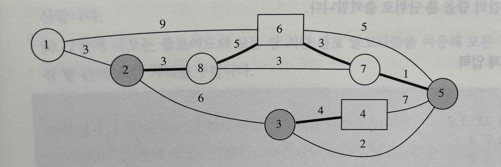
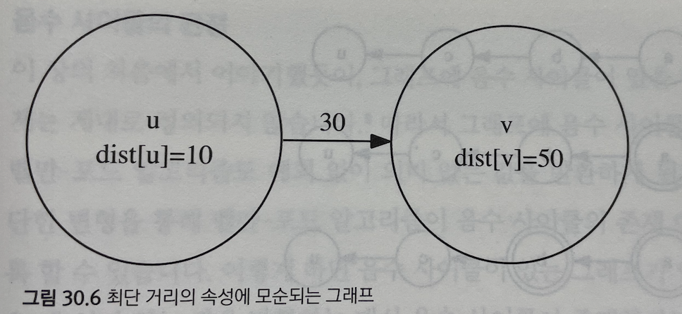

## Lecture 30. 최단 경로 알고리즘
by | 혜민  
pub date | 2020.11.28.Sat

---

*범위는 아니었지만 앞부분 복습*  
### 다익스트라(Dijkstra)의 최단 경로 알고리즘 | 단일 시작점에서 최단 경로를 계산하는 알고리즘  
- 우선순위 큐를 사용한다는 점을 빼면 너비 우선 탐색과 비슷
- 최단 거리를 갱신하고 큐에서 갱신되기 전의 값을 무시하는 것이 핵심

#### 30.3 문제: 신호 라우팅 (ROUTING)
- 특징 : 경로의 길이가 간선의 가중치의 합이 아니라 곱으로 정의됨
- 해결 방법 : 가중치 곱 대신에 가중치 곱의 로그 값을 최소화하는 경로 문제로 변형하면 간선의 가중치 로그 덧셈으로 해결 가능 -> 일반적인 다익스트라 알고리즘

#### 30.5 문제 : 소방차 (Firetrucks)
- 특징 : 불난 집에서 소방서를 구분할 필요 없고, 거리만 최소화하면 됨
- 해결 방법
  1. 각 소방서에서 따로 시작할 필요 없이 모든 소방서에서 다익스트라 알고리즘
  2. 가상의 시작점을 하나 추가한 뒤 이 시작점에서 다른 모든 소방서로 가중치 0인 간선 연결
  3. 이 시작점으로부터 다익스트라 알고리즘 수행하면 모든 위치에서 임의의 소방서 최단 거리 계산 가능 (어느 소방서까지의 거리인지는 모르지만 최단 값만 저장)




### 벨만-포드의 최단 경로 알고리즘 | 단일 시작점에서 음수 간선을 포함하여 최단 경로를 계산하는 알고리즘
- 다익스트라 알고리즘이 음수 간선이 있는 경우 정당성이 보장되지 않아 사용
- 음수 간선에 대해서 최단 경로를 찾을 수 있으며 음수 사이클이 있어 최단 경로가 정의되지 않을 경우도 판단
- 시작점에서 각 정점까지의 최단 거리의 상한을 예측하고 잔차를 줄여가는 방식으로 동작

#### 벨만-포드의 동작 과정

1. 시작점에서 시작점까지의 최단 거리가 0이므로 upper[s]=0으로, 나머지는 INF로 초기화
2. 벨만 포드 알고리즘에서 사용하는 최단 거리의 특성
```c++
// 시작점에서 u와 v까지의 최단 거리 dist[u]와 dist[v]에 대해 다음이 항상 성립
dist[v] <= dist[u]+w(u,v)
```


3. 위 특징에 모순되는 경우 upper[v]를 완화하며 반복적으로 실행
4. 최단 경로는 최대 |V|개의 정점을 가지므로 모든 간선에 대한 완화 과정은 최대 |V-1|번

#### 벨만-포드 알고리즘의 구현

```c++
// 정점의 개수
int V; 
// 그래프의 인접 리스트. (연결된 정점 번호, 간선 가중치) 쌍을 담는다.
vector<pair<int,int> > adj[MAX_V];

// 최종적으로 각 정점까리의 최단 거리가 저장된, 완화된 upper[] 반환
// 음수 사이클이 있을 경우 텅 빈 배열을 반환
vector<int> bellmanFord(int src) {
	// 시작점을 제외한 모든 정점까지의 최단 거리 상한을 INF로 둔다
	vector<int> upper(V, INF);
	upper[src] = 0;
	bool updated;
	// V번 순회한다
  // 제일 바깥의 for문은 완화를 위해?
  // 완화가 최대 v-1번 일어나고, 음수를 위해 1번 추가
	for(int iter = 0; iter < V; ++iter) {
		updated = false;
		for(int here = 0; here < V; ++here)
			for(int i = 0; i < adj[here].size(); i++)  {
				int there = adj[here][i].first;
				int cost = adj[here][i].second;
				// (here, there) 간선을 따라 완화를 시도한다
				if(upper[there] > upper[here] + cost) {
					// 성공
					upper[there] = upper[here] + cost;
					updated = true;
				}
			}
		// 모든 간선에 대해 완화가 실패할 경우 곧장 종료한다
		if(!updated) break;
	}
	// V번째 순회에서도 완화가 성공했다면 음수 사이클이 있다
	if(updated) upper.clear();
	return upper;
}

```

#### 30.10 문제: 시간여행 (TIMETRIP)
- 특징 : 그래프에 음수 사이클이 존재한다고 해서 가중치가 음의 무한대인 경로가 항상 존재하는 것은 아님
- 해결 방법 : 음수 사이클을 발견했을 때 시작점에서 이 사이클에 방문하고 종착점으로 가는 경로가 있는지 확인 -> `reachable[][]`배열 이용

```c
// 정점의 개수
int V; 
// 그래프의 인접 리스트. (연결된 정점 번호, 간선 가중치) 쌍을 담는다.
vector<pair<int,int> > adj[MAX_V];
// 경로 존재 여부
bool reachable[MAX_V][MAX_V];
// src에서 target으로 가는 최단 거리 계산
// 가중치가 음의 무한대인 경로가 있으면 -INF를 반환
int bellman2(int src, int target) {
    // 시작점을 제외한 모든 정점까리의 최단거리 상한 INF
    vector<int> upper(V, INF);
    upper[src] = 0;
    // V-1번 순회
    for(int iter = 0; iter < V-1; ++iter)
        for(int here = 0; here < V; ++here)
            for(int i = 0; i < adj[here].size(); i++) {
                int there = adj[here][i].first;
                int cost = adj[here][i].second;
                // (here, there)간선을 따라 완화 시도
                upper[there] = min (upper[there], upper[here]+cost);
            }
    // 음수 사이클 존재 여부 확인
    for(int here = 0; here< V; ++here)
        for(int i = 0; i < adj[here].size(); i++) {
            int there = adj[here][i].first;
            int cost = adj[here][i].second;
            // 완화가 성공한다면 here는 음수 사이클에 들어있다
            if (upper[here] + cost < upper[there])
            // 이 음수 사이클을 포함하는 경로가 있는가? 
            if(reachable[src][here] && reachable[here][target]) return -INF;
        }
     return upper[target];
}
```


### 플로이드의 모든 쌍 최단 거리 알고리즘 | 모든 정점 쌍에 대해 둘 사이의 최단 거리를 구하는 알고리즘
- 모든 정점에 대하 다익스트라 알고리즘을 반복 실행하는 것보다 빠르고 간단
- 경유점을 지나는 경우와 지나지 않는 경우를 나눠 동적 계획법으로 해결
- 점화식 : k라는 경유점을 지나는 최단 경로(u,v)의 길이 = min(`k를 지나지 않는 최단 경로의 길이`, `u,k까지 최단거리 + k,v까지 최단거리`)

#### 플로이드 알고리즘의 프로토타입

```c++
int V;                           // 정점의 개수
int adj[MAX_V][MAX_V];           // 그래프의 인접 행렬 표현
int C[MAX_V+1][MAX_V][MAX_V];    // 점화식의 답을 저장하는 배열

void floyd_prototype() {
	// C[0] 을 초기화
  // 정점 조건이 없으면 adj가 최단거리
	for(int i = 1; i <= V; ++i)
		for(int j = 1; j <= V; ++j)
			C[0][i][j] = adj[i][j];

	// C[k-1] 이 있으면 C[k] 의 답을 만들 수 있다
  // 수학적 귀납법 느낌
	for(int k = 1; k <= V; ++k)
		for(int u = 1; u <= V; ++u)
			for(int v = 1; v <= V; ++v)
				C[k][u][v] = min(C[k-1][u][v], C[k-1][u][k] + C[k-1][k][v]);
}

```
- 프로토타입의 문제: 구현은 빠르지만 메모리 사용량이 큼

#### 플로이드 알고리즘 구현
```c++
int V;                           // 정점의 개수
int adj[MAX_V][MAX_V];           // 간선의 가중치, 간선이 없으면 아주 큰 값을 넣음

void floyd() {
	for(int i = 0; i < V; ++i) adj[i][i] = 0;

	for(int k = 1; k <= V; ++k)
		for(int i = 1; i <= V; ++i) //if(adj[i][k] < 987654321)
			for(int j = 1; j <= V; ++j)
				adj[i][j] = min(adj[i][j], adj[i][k] + adj[k][j]);
	
}
```

#### 플로이드 알고리즘에서 실제 최단 경로 계산

```c++
int V;                           // 정점의 개수
int adj[MAX_V][MAX_V];           // 그래프의 인접 행렬 표현
int via[MAX_V][MAX_V];           // 최단 경로가 경유하는 점 중 가장 번호가 큰 정점

// 플로이드의 모든 쌍 최단 거리 알고리즘
void floyd2() {
  for(int i = 0; i < V; ++i) adj[i][i] = 0;
  memset(via, -1, sizeof(via));
  for(int k = 0; k < V; ++k)
    for(int i = 0; i < V; ++i)
      for(int j = 0; j < V; ++j)
        if(adj[i][j] > adj[i][k] + adj[k][j]) {
          via[i][j] = k;
          adj[i][j] = adj[i][k] + adj[k][j];
        }
      
}
// u에서 v로 가는 최단 경로를 계산해 path를 저장
void reconstruct(int u, int v, vector<int>& path) {
  // 기저 사례
  if(via[u][v] == -1) {
    path.push_back(u);
    if(u != v) path.push_back(v);
    }
} else {
  int w = via[u][v];
  reconstruct(u, w, path);
  path.pop_back(); //w가 중복으로 들어가므로 지우낟
  reconstruct(w, v, path);
}
```

#### 30.13 문제: 음주 운전 단속 (DRUNKEN)
- 특징 : 어떤 정점을 경유하느라에 따라 양상이 달라짐
- 해결 방법: 정점을 예상 시간별로 정렬 후 선택된 정점보다 단속 시간이 적게 걸리는 정점들만 경유해서 가는 방법, 선택된 정점을 경유하는 방법으로 점화식 구성

```c++
// 그래프의 인접 행렬 표현
int V, adj[500][500];
// 각 정점에서 음주 운전 단속을 할 때 걸리는 시간
int delay[500];
int W[500][500];
// 입력을 받을 때 1부터 시작하는 정점 번호를 0부터 시작하도록 변경했다고 가정
void solve() {
    // 모든 정점들을 예상 시간 별로 정렬
    vector<pair<int, int>> order;
    for(int i=0; i<V; ++i)
        order.push_back(make_pair(delay[i],i));
    sort(order.begin(), order.end());
    // 정점을 하나도 거치지 않고 얻을 수 있는 최단 경로
    for(int i = 0; i < V; ++i)
        for(int j=0;j<V;++j)
            if(i == j) W[i][j]=0;
            else W[i][j] = adj[i][j];
    int ret = INFINITY;
    for(int k = 0; k < V; ++k) {
        // k번째로 예상 시간이 적게 걸리는 정점 w까지를 지나서 얻을 수 있는 최단 거리
        // .second면 delay[i]가 아니라 i 아닌가? 정점 번호? 
        // w는 정점 번호가 맞음 이후 adj의 index로 사용하기 위해
        int w = order[k].second;
        for(int i = 0; i < V; ++i)
            for(int j = 0; j < V; ++j) {
                // 경유점이 있는 거리가 더 짧으면 최단 거리 갱신
                adj[i][j] = min(adj[i][j], adj[i][w] + adj[w][j]);
                // 최단 거리 갱신되면 최소 예상 시간도 갱신
                W[i][j] = min(adj[i][w]+delay[w]+adj[w][j], W[i][j]);
            }
    }
} // solve()로 정렬 이후 테스트 케이스는 W[s][t]를 출려하기만 하면 됨
```

#### 30.15 문제: 선거 공약 (PROMISES)
- 특징 : 간선이 추가됨에 따라 최단 경로 
- 해결 방법 : 정점 대신 간선을 추가할 때 갱신되지 않으면 의미없는 공약 판단

```c++
// adj[][]는 floyd() 의 수행 결과
int V, adj[200][200];

// 간선 (a,b) 를 추가했을 때 그래프의 최단 거리 배열 adj를
// 적절히 갱신한다. 간선이 아무런 의미가 없을 경우 false를
// 반환한다.
bool update(int a, int b, int c) {	
	if(adj[a][b] <= c) return false;
	for(int x = 0; x < V; ++x) 
		for(int y = 0; y < V; ++y) 
			// x~y 최단경로가 (a,b)를 이용하려면
			// x~a-b~y 혹은 x~b-a~y 의 형태를 가져야 한다.
			adj[x][y] = min(adj[x][y], 
					min(adj[x][a] + c + adj[b][y],
						adj[x][b] + c + adj[a][y]));
	return true;
}

```
