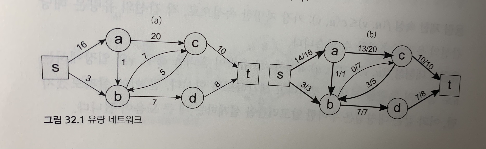
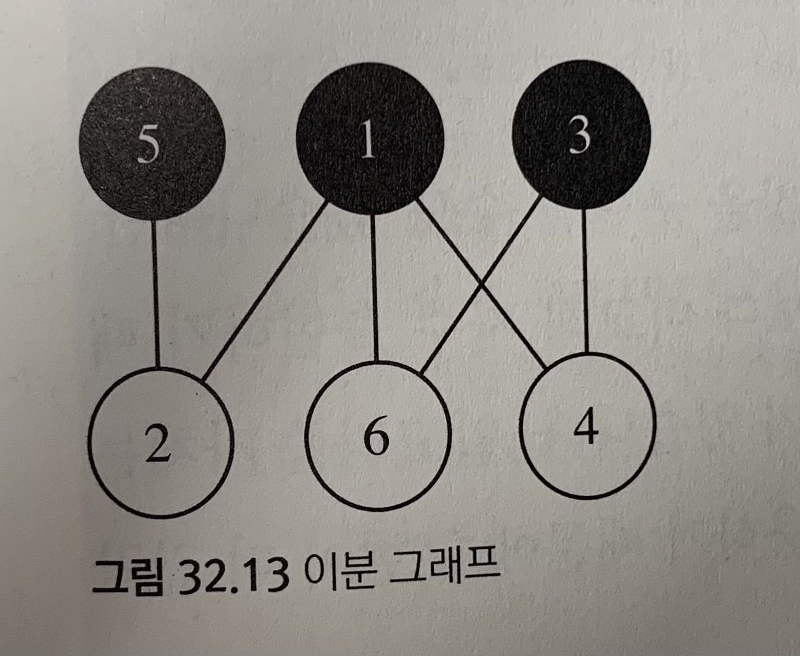
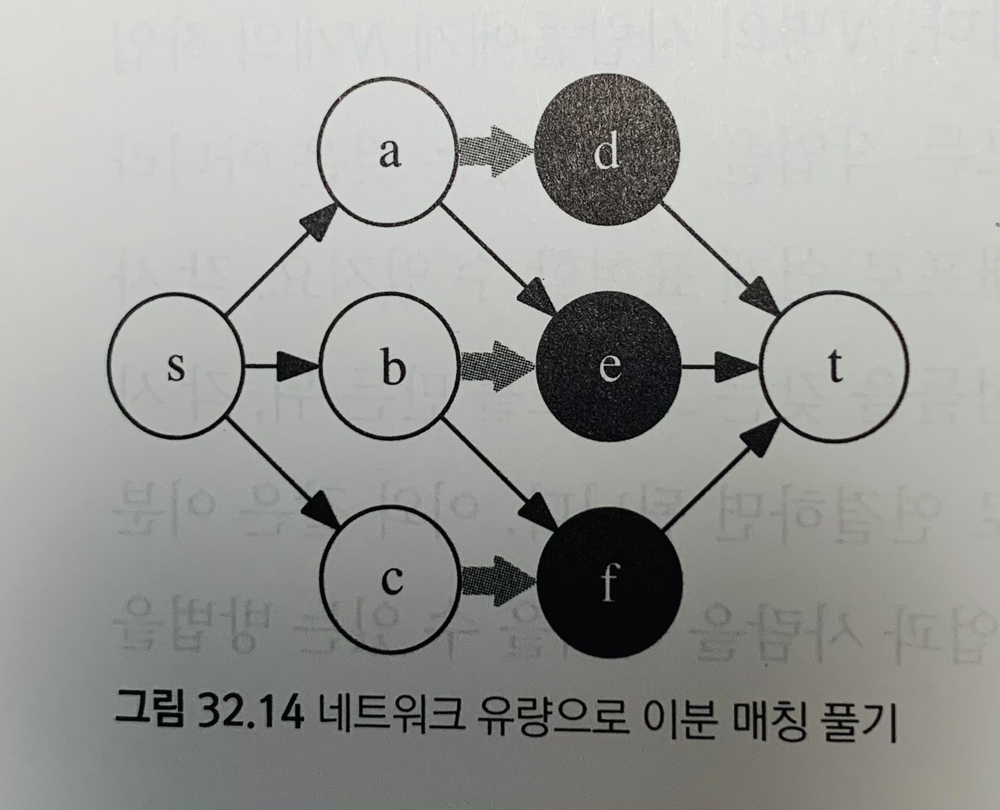

## Lecture 32. 네트워크 유량
by | 지은  
pub date | 2020.12.19.Sat
---

- 그래프의 '용량' 고려하기  
- 그래프에서 각 경로를 따라 보낼 수 있는 초당 자료의 용량은 경로에 포함된 간선 중 가장 용량이 작은 간선에 의해 결정  
👩‍🏫 네트워크 유량 문제: 각 간선이 용량을 갖는 그래프에서 두 정점 사이에 얼마나 많은 '흐름' 혹은 유량을 보낼 수 있는지를 계산하는 문제  



**유량 네트워크**  
`c(u, v)`: 정점 u에서 v로 가는 간선의 용량  
`f(u, v)`: 실제 흐르는 유량  

- 용량 제한 속성: `f(u, v) <= c(u, v)` 
- 유량의 대칭성: `f(u, v) = -f(v, u)`  
- 유량의 보존: 각 정점에 들어오는 유량과 나가는 유량의 양은 정확히 같아야 함  
(유량의 대칭성에 의해 정점에 들어오는 유량은 모두 음수로 표현되므로)  

- **소스(source)**: 유량이 시작되는 정점
- **싱크(sink)**: 유량이 도착하는 정점  
→ 이 두 점에서는 유량의 보존 속성 성립 X  

### 포드-풀커슨 알고리즘  
유량 네트워크의 모든 간선의 유량을 0으로 두고 시작해, 소스에서 싱크로 유량을 보낼 수 있는 경로를 찾아 유량 보내기를 반복  
- 증가 경로: 유량을 보내는 경로  
- 잔여 용량: 간선의 용량과 유량의 차이  
```
r(u, v) = c(u, v) - f(u, v)
```
- 증가 경로를 통해 보낼 수 있는 유량의 최대량은, 포함된 간선의 잔여 용량 중 가장 작은 값으로 결정  
- 두 정점이 서로 상대에게 유량을 보내줄 때 유량은 상쇄됨

**포드-풀커슨 알고리즘의 구현**  
잔여 용량이 남은 간선들만을 사용하는 너비 우선 탐색을 이용해 증가 경로 찾기  

[code32.1](https://github.com/zigsong/algorithm-int/blob/jieun/jieun/lec_31-32/code32_1.cpp) 


**정당성의 증명과 최소 컷 최대 유량 정리**  
소스가 속한 집합 **S**, 싱크가 속한 집합 **T**  
🤯🤯🤯  

**시간 복잡도와 탐색 알고리즘의 선택**
: 포드-풀커슨 알고리즘의 구현은 너비 우선 탐색을 사용하여 항상 가장 짧은 증가 경로만을 찾는다  
→ 최대 `O(|V||E|)개의 증가 경로` 사용  

**인접 리스트로 포드-풀커슨 알고리즘 구현하기**  
- 각 단방향 간선 (u,v)마다 용량이 0인 '유령' 간선 (v,u)를 네트워크에 추가해 줘야 함 → 유량을 상쇄하는 데만 사용  
- 😮 각 간선을 구조체로 표현하고, 각 간선이 반대 방향 간선의 포인터를 갖고 있도록 하면 자신의 반대 방향 간선에 빠르게 접근할 수 있음  

[code32.2](https://github.com/zigsong/algorithm-int/blob/jieun/jieun/lec_31-32/code32_2.cpp)  

---

### 네트워크 모델링 
**예제: 마일리지로 여행하기**  
: 양과 사용처가 제한된 자원을 효율적으로 분배하는 방법 찾기  
  
**예제: 도난당한 조각상**  
- 그래프의 최소 컷 문제  
- s를 포함하는 정점의 집합과 t를 포함하는 정점의 집합으로 집합들을 나눈 뒤, 두 집합을 잇는 간선 용량의 합을 최소화  
- 그래프의 각 정점을 '들어오는' 정점과 '나가는' 정점으로 쪼개기  
- 원래 그래프에서의 양방향 간선을 단방향 간선 두 개로 쪼갠 뒤, 모든 간선이 나가는 정점에서 들어오는 정점으로 연결되도록 변경  
- 정점 밖 간선들의 용량을 무제한으로 → 정점 내부의 간선들로만 구성!  
🤯 어렵다  

---

### 문제: 승부 조작  
- 제한된 자원을 분배하는 문제  
- 각 경기는 한 개의 '승수'를 갖고 있으며, 이 승수를 두 선수 중 한 명에게 보내 줌  
- 각 선수가 가져갈 수 있는 최대 승수 범위 내에게서 모든 경기의 승수를 분배할 수 있다면 성공!  

1. 각 경기를 표현하는 정점과 각 선수를 표현하는 정점들  
2. 소스 → 경기, 경기 → 선수, 선수 → 싱크 간선 연결 

[code32.3](https://github.com/zigsong/algorithm-int/blob/jieun/jieun/lec_31-32/code32_1.cpp)  

---

### 32. 이분 매칭  
- 그래프의 매칭: 끝점을 공유하지 않는 간선의 집합  
- (최대) 매칭 문제: 가장 큰 매칭을 찾아내는 문제  
👩‍🏫 좀 더 단순한 형태의, 이분 그래프에서의 최대 매칭 찾기  

**이분 매칭의 중요성**  
- 이분 그래프: 정점을 두 그룹으로 나눠서 모든 간선이 서로 다른 그룹의 정점들을 연결하도록 할 수 있는 그래프  


**네트워크 유량으로 이분 매칭 풀기**  

- 소스를 포함하는 그룹 A와, 싱크를 포함하는 그룹 B로 구분
- 소스에서 A의 모든 정점으로 간선 연결, B의 모든 정점에서 싱크로 간선 연결 → 유량 네트워크 탄생!  
- 모든 간선의 용량은 1, 그래프의 최대 유량을 구한 뒤 유량이 흐르는 간선들을 모으면 → 최대 매칭!  
 
**이분 매칭 구현하기** 
- 포드-풀커슨 알고리즘처럼 증가 경로를 찾은 뒤 유량 보내기 반복  
- 최대 유량이 제한되어 있기 때문에 깊이 우선 탐색 사용 가능  

[code32.5](https://github.com/zigsong/algorithm-int/blob/jieun/jieun/lec_31-32/code32_5.cpp)  

**예제: 여행 사진**  

**예제: 도미노로 직사각형 채우기**  
- 각 칸들을 정점으로 표현하고, 두 칸들이 변을 맞대고 있을 때 이들을 간선으로 연결 → 격자 그래프(grid graph)    
- 흰 칸을 표현하는 정점과 검은 칸을 표현하는 정점으로 나눠서, 번갈아 가면서 칠하기 → 이분 그래프 문제!  

[code32.6](https://github.com/zigsong/algorithm-int/blob/jieun/jieun/lec_31-32/code32_6.cpp)  

---

### 문제: 비숍  
1. 대각선으로 연속해 있는 빈 칸들을 하나로 묶기 → 각 묶음의 어느 칸에 비숍을 놓는가?  
2. 각 묶음을 서로 대응시키는 문제  
→ 각 묶음을 정점으로 표현하고, 두 묶음에 공통 원소가 있을 때 두 정점을 간선으로 연결해서 그래프 만들기  


[code32.7](https://github.com/zigsong/algorithm-int/blob/jieun/jieun/lec_31-32/code32_7.cpp)  