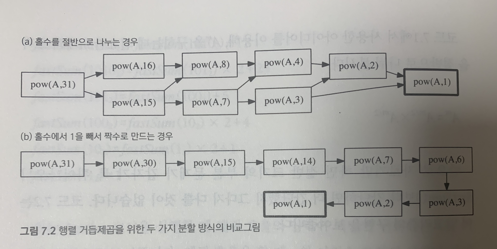

## Lecture7: 분할 정복
by: 지은  
pub date: 2020.9.26.Sat

- 한 조각과 나머지 전체로 나누는 대신 거의 같은 크기의 부분 문제로 나누기  
1. divide - 문제를 더 작은 문제로 분할
2. merge - 각 문제에 대해 구한 답을 원래 문제에 대한 답으로 병합
3. base case - 더 이상 답을 분할하지 않고 곧장 풀 수 있는 매우 작은 문제  

#### 예제: 수열의 빠른 합과 행렬의 빠른 제곱
- 기존 recursive([code 6-1]())에 비해 함수 호출 횟수가 절반으로 줄어듦
[code 7-1]()

#### 행렬의 거듭제곱
- 절반으로 나누는 알고리즘의 효율 저하 케이스

[code 7-2]()

#### 병합 정렬과 퀵 정렬  
- **병합 정렬** | 절반씩 쪼개 나간 후(`O(1)`) 하나의 배열로 합치는 병합 과정에서 `O(n)` 시간 소요  
- **퀵 정렬** | pivot을 기준으로 큰 수와 작은 수를 나누는 과정에서 `O(n)` 시간 소요, 이후에는 이미 정렬된 상태
- `O(n)`의 과정을 재귀 호출 전에 하느냐, 후에 하느냐의 문제 
- 문제를 base case까지 절반으로 나누는 데 `O(logn)` 시간 소요
➡️ `O(nlogn)`의 시간 소요 

#### 카라츠바의 빠른 곱셈 알고리즘  
- 이건 너무 어려운 것 같아요. 도와주세요. 
- 안 할래!

### 문제: 쿼드 트리 뒤집기  
- 재밌는 문제 😮 (백준에도 있음!)
- 🤔 Q. `string()`은 어떤 함수?
- 포인트! `decompress()` 함수에 s를 통째로 전달하는 것이 아니라, s의 한 글자를 가리키는 포인터를 전달(`iterator` 사용)
- 시간 복잡도: 함수 호출 횟수는 문자열의 길이에 비례 ➡️ `O(n)`

[code 7-5]()
[code 7-6]()

#### 울타리 잘라내기  
- for문으로 모든 울타리 순회하기 ➡️ `O(n^2)` 시간 소요
[code 7-7]()
- 여기도 도움 필요!
[code 7-8]()
